# Detailed Notes: Picking the Right Database

## **Core Philosophy**

### **It's NOT a Fight**

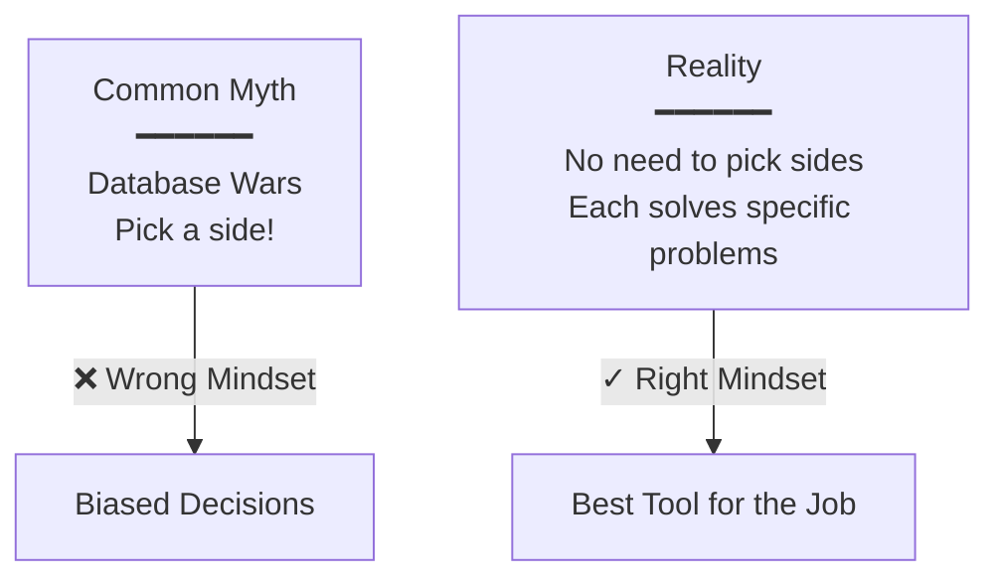

**Fundamental Truth:** A database is designed to solve a **particular problem really well**.

There's no "best" database - only the best database **for your specific use case**.

---

## **Understanding Database Overlap**

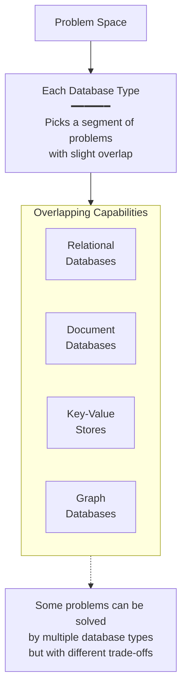

**Key Insight:** Each kind of database picks a **segment** of the problem space with **slight overlap**.

This means:
- Some use cases can be handled by multiple database types
- The "best" choice depends on your specific requirements
- There's intentional overlap - not everything is clear-cut

---

## **Debunking the Common Misconception**

### **The Myth**

❌ **"Picking Non-relational DB because relational Databases do not scale"**

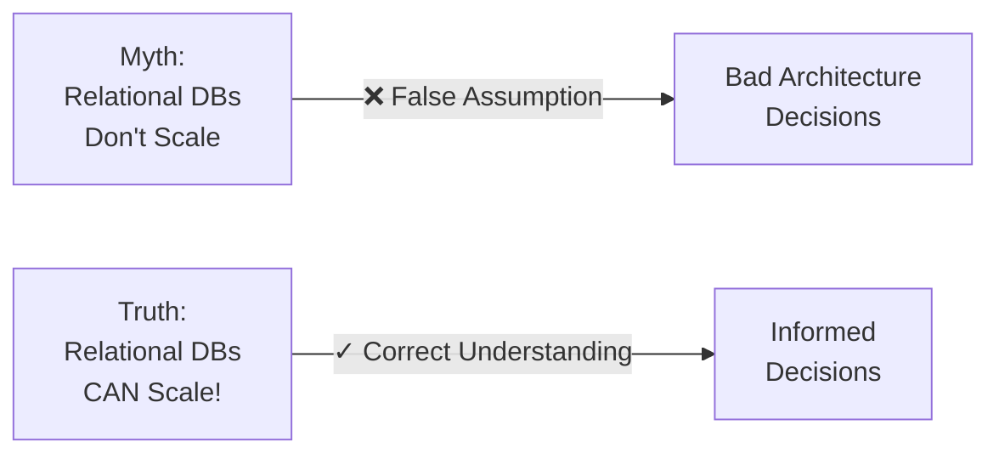

**Reality:** This is a **misconception**. Relational databases **can scale** if you apply the same techniques!

---

## **Why Non-Relational DBs Scale**

### **Built-in Design Choices**

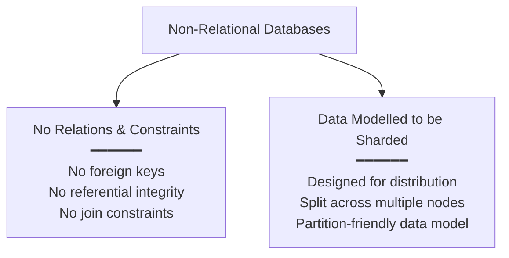

### **1. There are NO Relations and Constraints**

**What this means:**
- No foreign key constraints
- No referential integrity checks
- No complex joins required
- Each document/record is self-contained

**Benefit for Scaling:**
- Data can be distributed without worrying about maintaining relationships across nodes
- No cross-shard constraints to enforce
- Easier to partition and distribute

### **2. Data is Modelled to be Sharded**

**Design Philosophy:**
- Data structure designed from the ground up for distribution
- Natural partitioning keys
- Self-contained units of data
- Minimal cross-shard operations needed

**Result:**
- Easy to **split across multiple nodes**
- Horizontal scaling is native, not bolted-on

---

## **The Critical Insight**

### **Relational Databases CAN Scale Too!**

**If we relax the above ↑ on relational DB, we can scale it too!!**

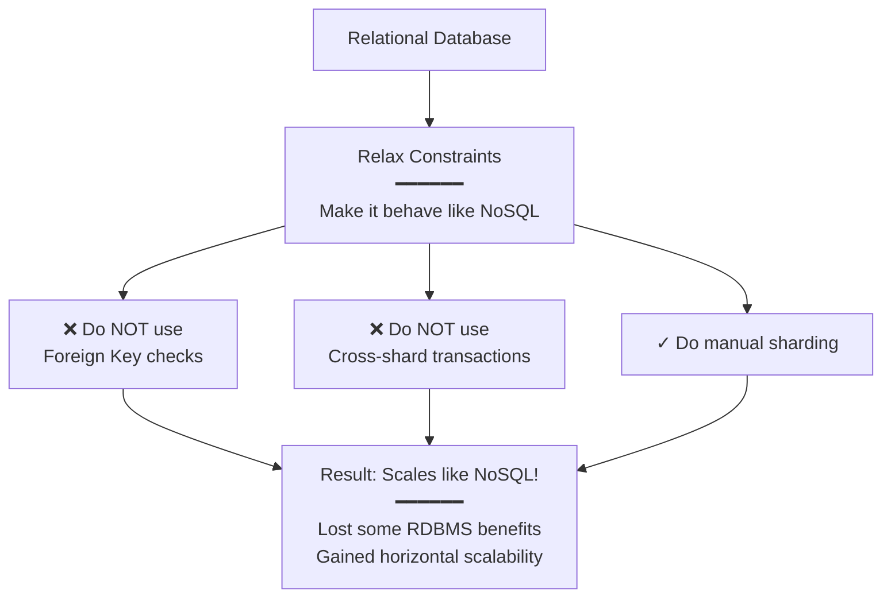

### **Three Steps to Scale Relational Databases**

**1. Do NOT use Foreign Key checks**
```sql
-- Instead of:
CREATE TABLE orders (
    user_id INT,
    FOREIGN KEY (user_id) REFERENCES users(id)
);

-- Use:
CREATE TABLE orders (
    user_id INT  -- No foreign key constraint
);
```

**Why:** Foreign keys enforce referential integrity across tables, making sharding difficult.

**2. Do NOT use Cross-shard transactions**
```sql
-- Avoid:
BEGIN TRANSACTION;
    UPDATE users SET balance = balance - 100 WHERE id = 123;  -- Shard 1
    UPDATE orders SET status = 'paid' WHERE id = 456;         -- Shard 2
COMMIT;

-- Instead: Handle at application level with eventual consistency
```

**Why:** Distributed transactions across shards are slow and complex.

**3. Do manual sharding**
- Partition data yourself
- Route queries to appropriate shards
- Handle shard management at application level

**Result:** Your relational database now scales horizontally like NoSQL!

---

## **So, Does This Mean No DB is Different?**

### **Answer: NO!!**

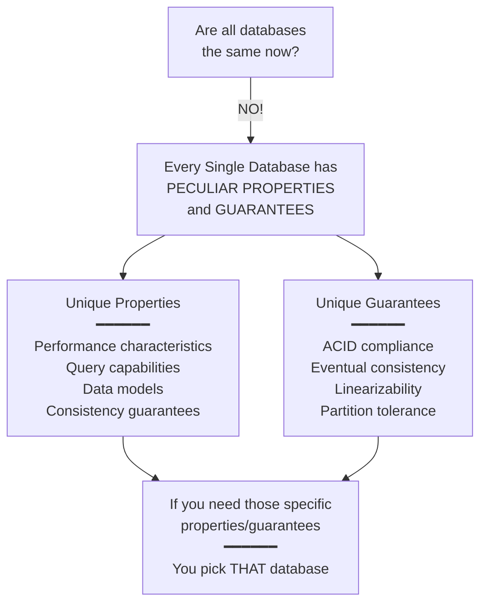

**Every single database has some peculiar properties and guarantees**

**And if you need those, you pick that DB.**

### **Examples of Unique Properties:**

| Database | Unique Properties |
|----------|------------------|
| **PostgreSQL** | ACID compliance, complex queries, JSONB, full-text search |
| **Redis** | In-memory speed, advanced data structures (lists, sets, sorted sets), pub/sub |
| **MongoDB** | Flexible schema, rich queries, aggregation pipeline |
| **Neo4j** | Native graph storage, Cypher query language, graph algorithms |
| **Cassandra** | Write-optimized, eventual consistency, tunable consistency |
| **Elasticsearch** | Full-text search, inverted indexes, analytics |

---

## **How Does This Help in Designing Systems?**

### **Critical Design Principle**

**While designing any system:**

❌ **DO NOT** jump to a particular DB right away

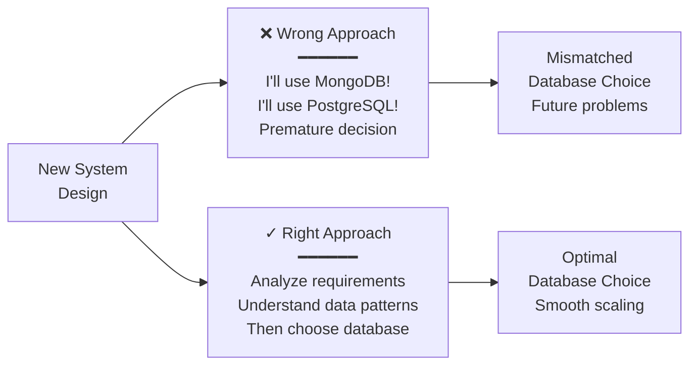

**Instead:** Follow a systematic analysis process.

---

## **The 5-Step Database Selection Process**

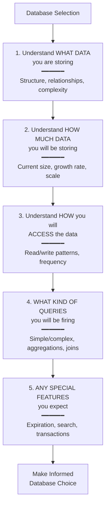

### **Step 1: Understand WHAT DATA You Are Storing**

**Questions to Ask:**
- What is the structure of the data?
- Is it highly structured or flexible?
- Are there relationships between entities?
- Is it hierarchical or flat?
- Does the schema change frequently?

**Examples:**
- **User profiles** - Semi-structured, flexible schema
- **Financial transactions** - Highly structured, rigid schema
- **Social connections** - Graph structure, relationships
- **Product catalog** - Varied attributes per product type

---

### **Step 2: Understand HOW MUCH DATA You Will Be Storing**

**Questions to Ask:**
- What's the current data volume?
- What's the expected growth rate?
- Will it fit on a single machine?
- What's the 3-year projection?

**Scale Thresholds:**
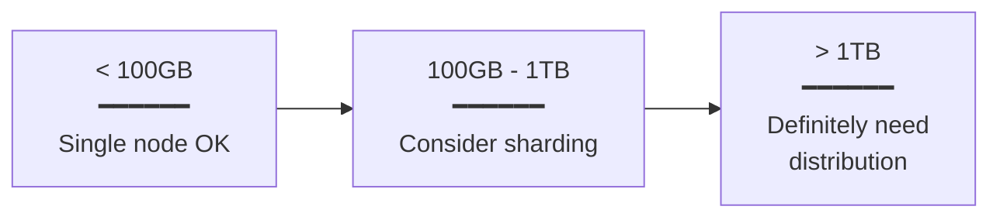

---

### **Step 3: Understand HOW You Will Be Accessing the Data**

**Questions to Ask:**
- Read-heavy or write-heavy?
- Random access or sequential?
- By key or by query?
- Real-time or batch?

**Access Patterns:**

| Pattern | Characteristics | Best Database Type |
|---------|----------------|-------------------|
| **Key-based** | Direct lookup by ID | Key-Value Store |
| **Query-based** | Complex filters, aggregations | Relational/Document |
| **Graph traversal** | Following relationships | Graph Database |
| **Full-text search** | Text search across documents | Search Engine (Elasticsearch) |
| **Time-series** | Ordered by timestamp | Time-series DB |

---

### **Step 4: WHAT KIND OF QUERIES You Will Be Firing**

**Query Complexity Spectrum:**

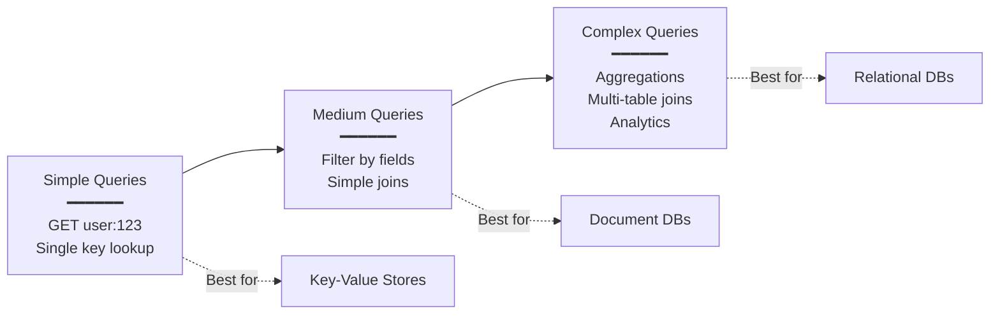

**Examples:**

**Simple:**
```python
# Key-value lookup
user = redis.get("user:123")
```

**Medium:**
```javascript
// Document query
db.users.find({ 
    age: { $gt: 25 }, 
    city: "New York" 
})
```

**Complex:**
```sql
-- Relational aggregation
SELECT 
    u.name,
    COUNT(o.id) as order_count,
    SUM(o.total) as total_spent
FROM users u
LEFT JOIN orders o ON u.id = o.user_id
WHERE u.created_at > '2024-01-01'
GROUP BY u.id
HAVING total_spent > 1000
ORDER BY total_spent DESC;
```

---

### **Step 5: ANY SPECIAL FEATURES You Expect**

**Common Special Features:**

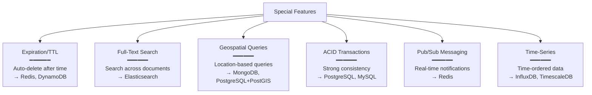

**Example: Expiration**
```python
# Redis TTL
redis.setex("session:abc123", 3600, user_data)  # Expires in 1 hour

# DynamoDB TTL
item = {
    'session_id': 'abc123',
    'user_data': {...},
    'ttl': int(time.time()) + 3600  # Unix timestamp
}
```

---

## **Decision Tree: How to Pick the Right DB**

**(Not exhaustive, but you'll get the idea)**

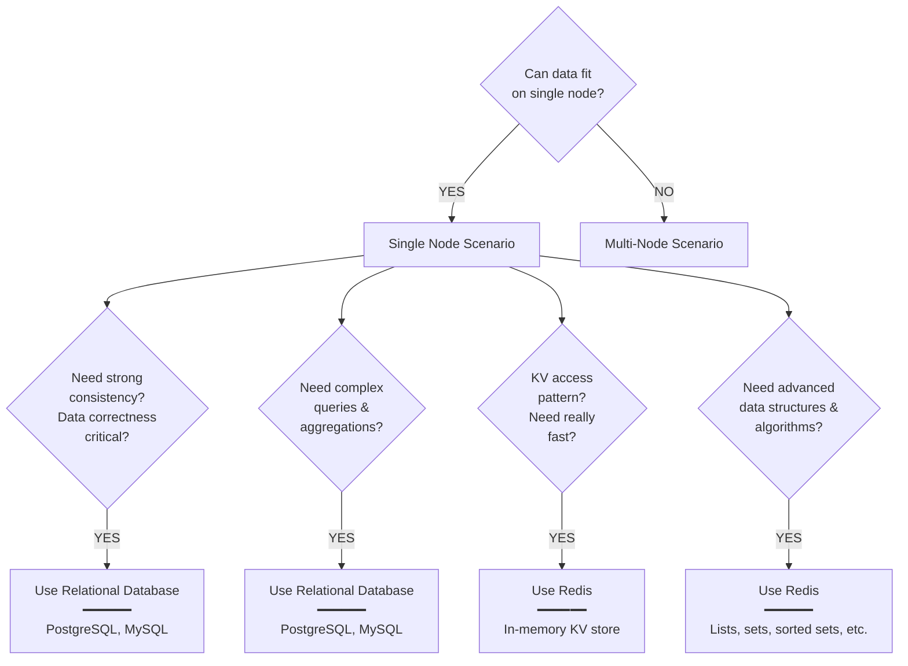

### **Scenario 1: Data CAN Fit on Single Node**

#### **Option A: Need Strong Consistency & Data Correctness**

**Choose: Relational Database**

```mermaid
graph LR
    REQ[Requirements<br/>━━━━━━<br/>✓ Single node<br/>✓ Strong consistency<br/>✓ Data correctness critical]
    
    CHOICE[PostgreSQL or MySQL]
    
    USE[Use Cases<br/>━━━━━━<br/>Financial systems<br/>Inventory management<br/>Order processing]
    
    REQ --> CHOICE --> USE
    
    style CHOICE fill:#1c3d2d,stroke:#3c7c5c,stroke-width:3px
```

**Why:**
- ACID transactions guarantee data integrity
- Foreign keys enforce referential integrity
- Strong consistency across all reads
- Battle-tested for critical data

**Example Use Cases:**
- Banking transactions
- E-commerce orders
- Accounting systems
- Inventory management

---

#### **Option B: Need Complex Queries & Aggregations**

**Choose: Relational Database**

```mermaid
graph LR
    REQ[Requirements<br/>━━━━━━<br/>✓ Single node<br/>✓ Complex queries<br/>✓ Analytics & reporting]
    
    CHOICE[PostgreSQL or MySQL]
    
    QUERIES[Query Types<br/>━━━━━━<br/>JOINs across tables<br/>Aggregations SUM, AVG<br/>GROUP BY analysis]
    
    REQ --> CHOICE --> QUERIES
    
    style CHOICE fill:#1c3d2d,stroke:#3c7c5c,stroke-width:3px
```

**Why:**
- SQL is powerful for complex queries
- Optimized query planners
- Supports joins, subqueries, CTEs
- Rich aggregation functions

**Example Queries:**
```sql
-- Sales report by region
SELECT 
    r.name as region,
    SUM(o.total) as total_sales,
    AVG(o.total) as avg_order_value,
    COUNT(DISTINCT o.customer_id) as unique_customers
FROM orders o
JOIN customers c ON o.customer_id = c.id
JOIN regions r ON c.region_id = r.id
WHERE o.created_at >= '2024-01-01'
GROUP BY r.id
ORDER BY total_sales DESC;
```

---

#### **Option C: KV Access Pattern BUT Need Really Fast**

**Choose: Redis**

```mermaid
graph LR
    REQ[Requirements<br/>━━━━━━<br/>✓ Key-value access<br/>✓ Microsecond latency<br/>✓ High throughput]
    
    CHOICE[Redis]
    
    USE[Use Cases<br/>━━━━━━<br/>Session storage<br/>Caching<br/>Rate limiting<br/>Leaderboards]
    
    REQ --> CHOICE --> USE
    
    style CHOICE fill:#2d3d4a,stroke:#4a6d7c,stroke-width:3px
```

**Why:**
- In-memory storage = sub-millisecond latency
- Optimized for GET/SET operations
- Handles millions of operations per second
- Built-in expiration (TTL)

**Example Use Cases:**
```python
# Session management
redis.setex(f"session:{session_id}", 3600, session_data)

# Caching
cache_key = f"user:profile:{user_id}"
cached = redis.get(cache_key)
if not cached:
    data = db.query_user(user_id)
    redis.setex(cache_key, 300, json.dumps(data))

# Rate limiting
key = f"rate_limit:{user_id}"
count = redis.incr(key)
if count == 1:
    redis.expire(key, 60)  # Reset after 1 minute
if count > 100:
    raise RateLimitExceeded()
```

---

#### **Option D: Need Advanced Data Structures & Algorithms**

**Choose: Redis**

```mermaid
graph LR
    REQ[Requirements<br/>━━━━━━<br/>✓ Sorted sets<br/>✓ Lists<br/>✓ Bitmaps<br/>✓ HyperLogLog]
    
    CHOICE[Redis]
    
    USE[Use Cases<br/>━━━━━━<br/>Leaderboards<br/>Real-time rankings<br/>Queues<br/>Unique visitors]
    
    REQ --> CHOICE --> USE
    
    style CHOICE fill:#2d3d4a,stroke:#4a6d7c,stroke-width:3px
```

**Why:**
- Rich data structures beyond simple key-value
- Atomic operations on complex types
- Built-in algorithms (ZRANK, LPUSH, etc.)

**Example Use Cases:**

**Leaderboard with Sorted Sets:**
```python
# Add score
redis.zadd("leaderboard", {user_id: score})

# Get top 10
top_10 = redis.zrevrange("leaderboard", 0, 9, withscores=True)

# Get user rank
rank = redis.zrevrank("leaderboard", user_id)
```

**Queue with Lists:**
```python
# Producer
redis.lpush("task_queue", json.dumps(task))

# Consumer
task = redis.brpop("task_queue", timeout=5)
```

---

### **Scenario 2: Data CANNOT Fit on Single Node**

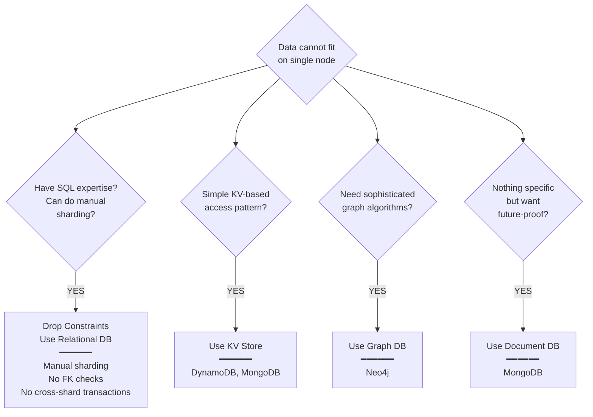

---

#### **Option A: Have SQL Expertise & Can Do Manual Sharding**

**Choose: Drop Constraints & Go for Relational DB**

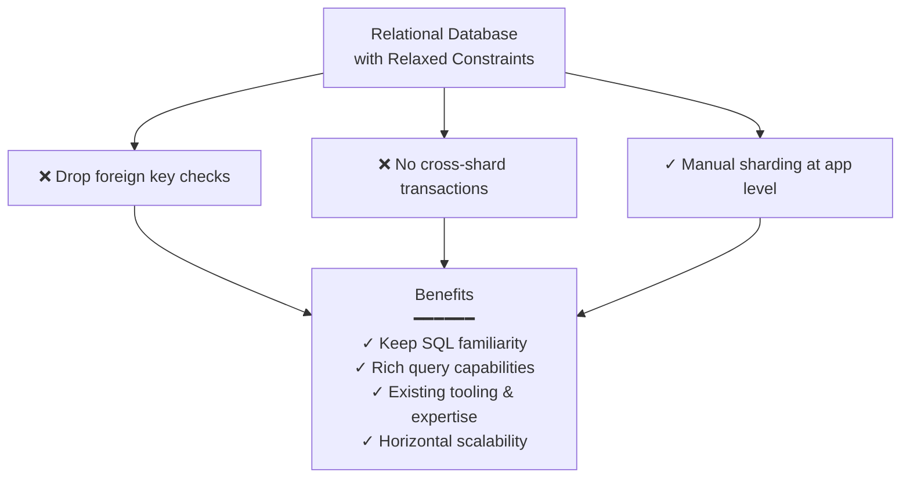

**Why:**
- Team already knows SQL
- Don't want to learn new database paradigm
- Need complex queries (within shard)
- Can handle operational complexity

**Implementation:**
```python
# Shard routing at application level
def get_shard(user_id):
    shard_id = hash(user_id) % NUM_SHARDS
    return shard_connections[shard_id]

# Query goes to appropriate shard
conn = get_shard(user_id)
result = conn.query("SELECT * FROM users WHERE id = %s", (user_id,))
```

**Trade-offs:**
- ✓ Keep SQL and existing tools
- ✓ Complex queries within each shard
- ❌ More operational complexity
- ❌ Application handles routing
- ❌ Limited cross-shard queries

---

#### **Option B: Simple KV-Based Access**

**Choose: KV Store like DynamoDB, MongoDB**

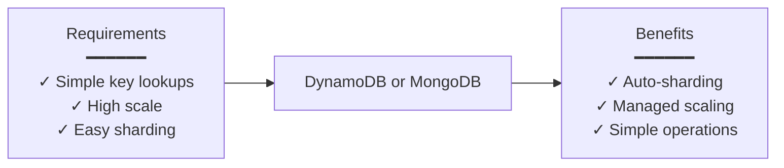

**Why:**
- Access pattern is primarily by key
- Don't need complex queries
- Want automatic sharding
- Need massive scale

**Example:**
```python
# DynamoDB
dynamodb = boto3.resource('dynamodb')
table = dynamodb.Table('Users')

# Simple key access
response = table.get_item(Key={'user_id': '12345'})

# MongoDB (used as KV store)
user = db.users.find_one({'_id': user_id})
```

**Best For:**
- User profiles
- Session data
- Product catalog
- Simple CRUD operations

---

#### **Option C: Sophisticated Graph Algorithms**

**Choose: Graph DB like Neo4j**

```mermaid
graph LR
    REQ[Requirements<br/>━━━━━━<br/>✓ Graph relationships<br/>✓ Traversal queries<br/>✓ Graph algorithms]
    
    CHOICE[Neo4j]
    
    USE[Use Cases<br/>━━━━━━<br/>Social networks<br/>Recommendations<br/>Fraud detection<br/>Knowledge graphs]
    
    REQ --> CHOICE --> USE
    
    style CHOICE fill:#2d3d4a,stroke:#4a6d7c,stroke-width:3px
```

**Why:**
- Data is inherently a graph
- Need to traverse relationships
- Graph algorithms are core requirement
- Query patterns involve "hops"

**Example Queries:**
```cypher
// Find friends of friends
MATCH (me:Person {id: 123})-[:FRIENDS_WITH]->(friend)-[:FRIENDS_WITH]->(fof)
WHERE NOT (me)-[:FRIENDS_WITH]->(fof) AND me <> fof
RETURN fof

// Shortest path
MATCH path = shortestPath(
  (alice:Person {name: "Alice"})-[*]-(bob:Person {name: "Bob"})
)
RETURN path
```

---

#### **Option D: Nothing Specific, But Want Future-Proof**

**Choose: Document DB like MongoDB**

```mermaid
graph LR
    REQ[Requirements<br/>━━━━━━<br/>✓ Flexible needs<br/>✓ Schema may change<br/>✓ Want options]
    
    CHOICE[MongoDB]
    
    BENEFIT[Benefits<br/>━━━━━━<br/>✓ Flexible schema<br/>✓ Good query support<br/>✓ Auto-sharding<br/>✓ Versatile]
    
    REQ --> CHOICE --> BENEFIT
    
```

**Why:**
- Don't have specific requirements yet
- Schema might evolve
- Want reasonable performance across use cases
- Need flexibility

**Characteristics:**
- Schema-less (flexible structure)
- Supports complex queries (unlike pure KV stores)
- Built-in sharding
- Rich aggregation framework
- Good middle ground

**Example:**
```javascript
// Flexible schema
db.products.insert({
    _id: 1,
    name: "Laptop",
    // Schema can vary per document
    specs: {
        processor: "Intel i7",
        ram: "16GB"
    }
})

db.products.insert({
    _id: 2,
    name: "T-Shirt",
    // Different fields - no problem!
    sizes: ["S", "M", "L"],
    colors: ["red", "blue"]
})

// Still supports complex queries
db.products.aggregate([
    { $match: { price: { $lt: 1000 } } },
    { $group: { _id: "$category", avgPrice: { $avg: "$price" } } }
])
```

---

## **Complete Decision Matrix**

| Scenario | Requirement | Best Choice | Key Reason |
|----------|------------|-------------|------------|
| **Single Node** | Strong consistency | Relational DB | ACID guarantees |
| **Single Node** | Complex queries | Relational DB | SQL power |
| **Single Node** | Fast KV access | Redis | In-memory speed |
| **Single Node** | Advanced DS | Redis | Rich data structures |
| **Multi-Node** | SQL expertise | Relational (sharded) | Keep familiarity |
| **Multi-Node** | Simple KV access | DynamoDB/MongoDB | Auto-sharding |
| **Multi-Node** | Graph algorithms | Neo4j | Native graph support |
| **Multi-Node** | Future-proof | MongoDB | Flexibility |

---

## **Key Takeaways**

✅ **It's not a fight** - No need to pick sides, each database solves specific problems

✅ **Overlapping capabilities** - Multiple databases can handle some use cases, but with different trade-offs

✅ **The scaling myth** - Relational databases CAN scale if you relax constraints (no FK, no cross-shard transactions, manual sharding)

✅ **NoSQL advantages** - Built-in sharding and no constraints make them naturally scalable

✅ **Every DB is unique** - Each has peculiar properties and guarantees - pick based on what you need

✅ **Don't jump to conclusions** - Don't immediately pick a database when designing systems

✅ **Follow the 5 steps:**
1. What data are you storing?
2. How much data?
3. How will you access it?
4. What queries will you run?
5. Any special features needed?

✅ **Data size matters** - Single vs multi-node changes your options significantly

✅ **Match access patterns** - KV access → KV store, Complex queries → Relational, Graph → Graph DB

✅ **When in doubt** - Document DB (MongoDB) is a versatile middle ground

✅ **Expertise counts** - If your team knows SQL well, sharded relational DB might be better than learning NoSQL

**Remember:** The "right" database is the one that best matches your specific requirements, not the most popular or newest one!
