# Detailed Notes: Caching

## **What is Caching?**

### **Core Definition**

**Caches are anything that helps you avoid an expensive:**
- **Network I/O** (API calls, remote requests)
- **Disk I/O** (reading from disk, database queries)
- **Computation** (complex calculations, processing)

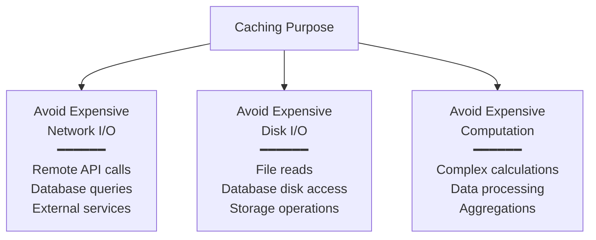

### **Primary Benefit**

⚡ **Performance Improvement** - Dramatically faster response times by avoiding expensive operations.

---

## **Common Use Cases for Caching**

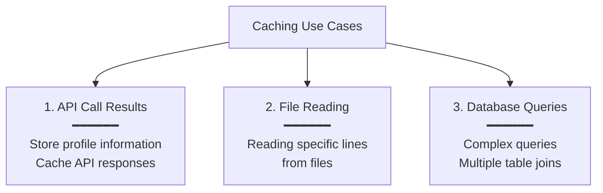

### **1. API Call to Get Profile Information**

**Problem:** Every time you need user profile data, making an API call or database query is expensive.

**Solution:** Cache the profile data.

```python
# Without cache - expensive every time
def get_user_profile(user_id):
    return database.query(f"SELECT * FROM users WHERE id = {user_id}")

# With cache - fast after first access
def get_user_profile(user_id):
    cache_key = f"user:profile:{user_id}"
    
    # Check cache first
    cached = cache.get(cache_key)
    if cached:
        return cached  # Fast! Return from cache
    
    # Cache miss - fetch from database
    profile = database.query(f"SELECT * FROM users WHERE id = {user_id}")
    
    # Store in cache for future requests
    cache.set(cache_key, profile, ttl=300)  # Cache for 5 minutes
    
    return profile
```

### **2. Reading a Specific Line from a File**

**Problem:** Opening and reading from disk is slow.

**Solution:** Cache frequently accessed file content.

```python
# Without cache - reads from disk every time
def get_config_value(key):
    with open('config.txt', 'r') as f:
        for line in f:
            if line.startswith(key):
                return line.split('=')[1]

# With cache - reads once, serves from memory
config_cache = {}

def get_config_value(key):
    if key in config_cache:
        return config_cache[key]  # Fast! From memory
    
    # Cache miss - read from disk
    with open('config.txt', 'r') as f:
        for line in f:
            if line.startswith(key):
                value = line.split('=')[1]
                config_cache[key] = value
                return value
```

### **3. Doing Multiple Table Joins**

**Problem:** Complex SQL queries with multiple joins are slow.

**Solution:** Cache the query results.

```python
# Expensive query
def get_user_orders_with_products(user_id):
    query = """
        SELECT u.name, o.order_date, p.product_name, p.price
        FROM users u
        JOIN orders o ON u.id = o.user_id
        JOIN order_items oi ON o.id = oi.order_id
        JOIN products p ON oi.product_id = p.id
        WHERE u.id = ?
    """
    return database.query(query, user_id)

# With cache
def get_user_orders_with_products(user_id):
    cache_key = f"user:orders:{user_id}"
    
    cached = cache.get(cache_key)
    if cached:
        return cached
    
    # Expensive join query
    result = database.query(query, user_id)
    cache.set(cache_key, result, ttl=600)  # Cache for 10 minutes
    
    return result
```

---

## **How Caching Works**

### **Architecture Pattern**

**Store frequently accessed data in a temporary storage location**

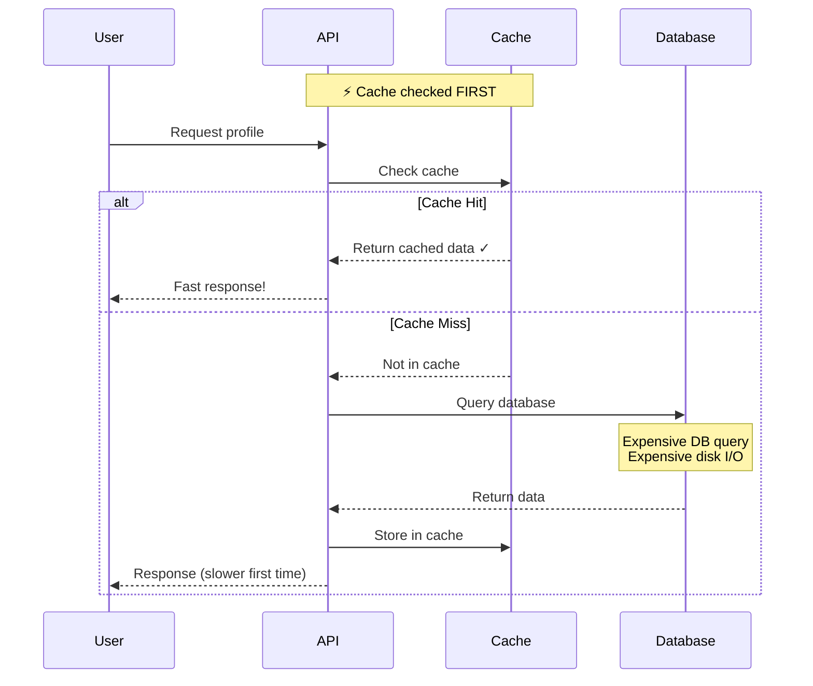

### **Key Principles**

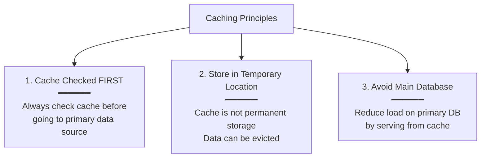

---

## **Cache Characteristics**

### **Trade-off: Speed vs Cost**

**Caches are faster and expensive**

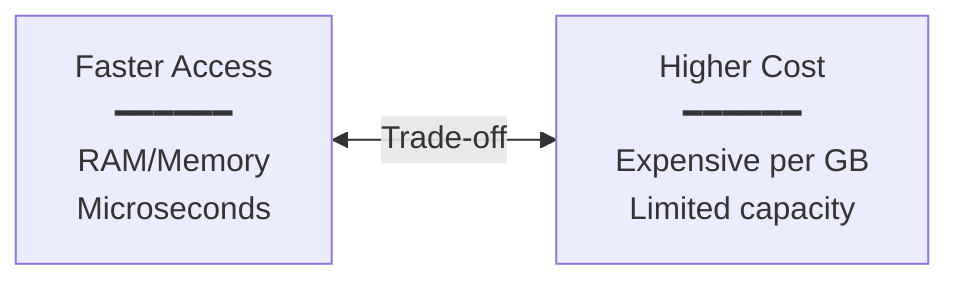

**Because of this trade-off:**

❌ **We do NOT cache all the data**

✅ **We cache only a subset - data that is most likely to be accessed**

### **What to Cache?**

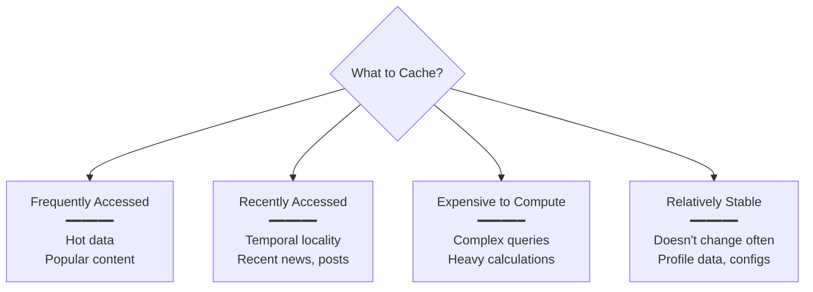

**Cache Selection Strategy:**

| Data Type | Cache? | Why? |
|-----------|--------|------|
| User profiles | ✓ Yes | Frequently accessed, stable |
| Recent news articles | ✓ Yes | Recently accessed, high traffic |
| Real-time stock prices | ❌ No | Changes too frequently |
| All historical data | ❌ No | Too large, rarely accessed |
| Authentication tokens | ✓ Yes | Every request needs it |
| Complex report results | ✓ Yes | Expensive to compute |

---

## **Important Clarification**

### **Caches Are NOT Restricted to RAM-Based Storage**

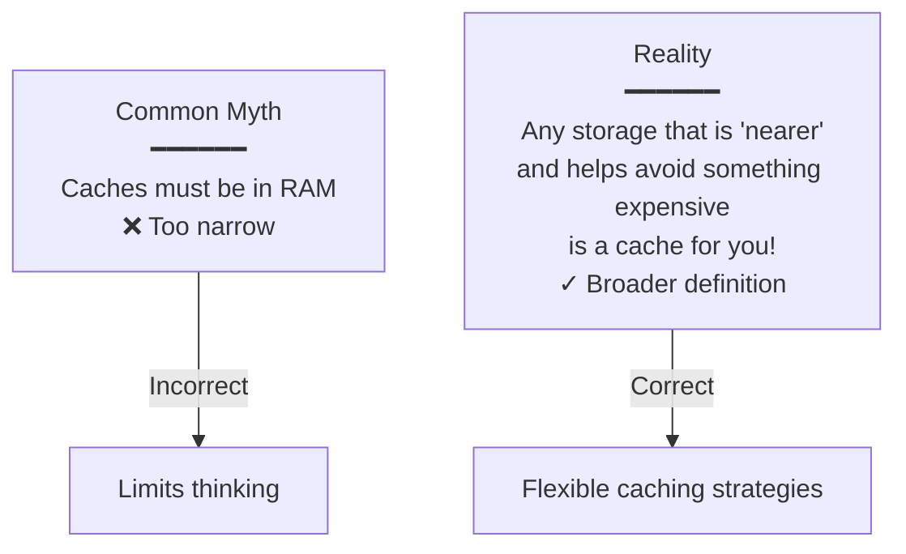

**Definition:** Any storage that is **'nearer'** and helps you avoid something **expensive** is a cache for you!

### **Cache Hierarchy Examples**

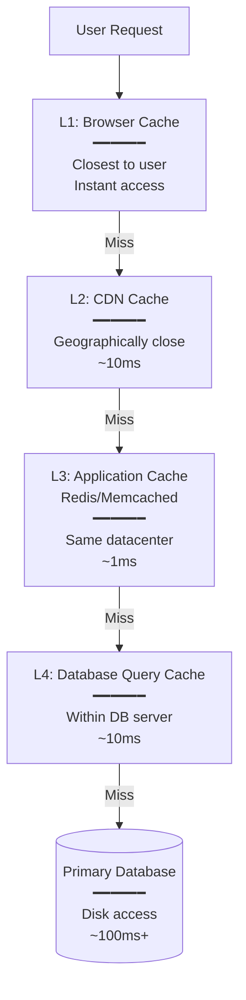

**Examples of Different Cache Types:**

| Level | Storage Type | Use Case | Latency |
|-------|--------------|----------|---------|
| **Browser** | LocalStorage | Static assets, CSS, JS | ~0ms (instant) |
| **CDN** | Edge servers | Images, videos | ~10-50ms |
| **Application** | Redis (RAM) | Session data, hot data | ~1ms |
| **Database** | Query cache | Frequent queries | ~10ms |
| **OS** | Page cache (RAM) | Recently accessed files | ~0.1ms |
| **CPU** | L1/L2/L3 cache | Instructions, data | Nanoseconds |

---

## **Cache Implementation**

### **In Their Simplest Form**

**Caches are just glorified hash tables**

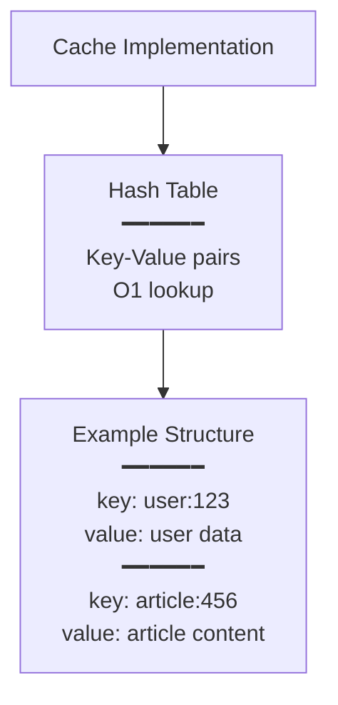

**Basic Cache Structure:**

```python
# Simple cache implementation
class SimpleCache:
    def __init__(self):
        self.cache = {}  # Just a hash table!
    
    def get(self, key):
        return self.cache.get(key)
    
    def set(self, key, value):
        self.cache[key] = value
    
    def delete(self, key):
        if key in self.cache:
            del self.cache[key]

# Usage
cache = SimpleCache()

# Store
cache.set("user:123", {"name": "Alice", "age": 30})

# Retrieve - O(1)
user = cache.get("user:123")
```

**More Advanced Cache (with TTL):**

```python
import time

class CacheWithTTL:
    def __init__(self):
        self.cache = {}
        self.expiry = {}
    
    def get(self, key):
        # Check if expired
        if key in self.expiry and time.time() > self.expiry[key]:
            del self.cache[key]
            del self.expiry[key]
            return None
        
        return self.cache.get(key)
    
    def set(self, key, value, ttl=None):
        self.cache[key] = value
        
        if ttl:
            self.expiry[key] = time.time() + ttl
    
    def delete(self, key):
        if key in self.cache:
            del self.cache[key]
        if key in self.expiry:
            del self.expiry[key]

# Usage
cache = CacheWithTTL()

# Store with 5 minute expiration
cache.set("session:abc123", session_data, ttl=300)

# Will return None after 5 minutes
session = cache.get("session:abc123")
```

---

## **Real-World Caching Examples**

### **1. Google News: Recent Articles Cache**

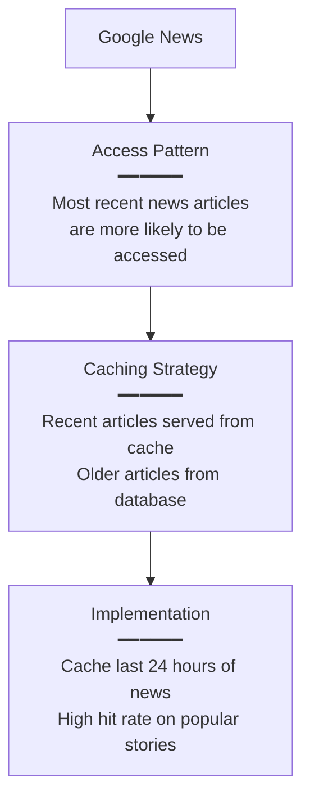

**Why it works:**
- **Temporal locality** - Recent news is accessed more frequently
- **Predictable pattern** - People read today's news, not last month's
- **High hit rate** - Most requests hit the cache

**Implementation:**

```python
def get_news_articles(category):
    cache_key = f"news:{category}:recent"
    
    # Check cache
    cached = redis.get(cache_key)
    if cached:
        return json.loads(cached)
    
    # Cache miss - get from database
    articles = database.query(
        "SELECT * FROM articles WHERE category = ? "
        "AND published_at > NOW() - INTERVAL 24 HOUR "
        "ORDER BY published_at DESC LIMIT 50",
        category
    )
    
    # Cache for 5 minutes
    redis.setex(cache_key, 300, json.dumps(articles))
    
    return articles
```

---

### **2. Auth Tokens: Cached Authentication**

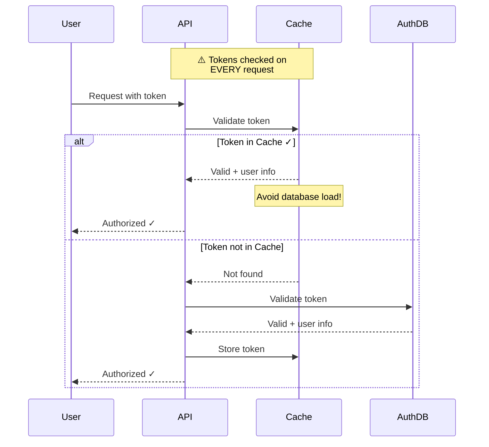

**Why cache authentication?**
- **High frequency** - Every single API request needs authentication
- **Expensive validation** - Database queries or cryptographic operations
- **Immutable** - Token doesn't change during its lifetime

**Implementation:**

```python
def authenticate_request(token):
    cache_key = f"auth:token:{token}"
    
    # Check cache first - CRITICAL for performance
    cached_user = cache.get(cache_key)
    if cached_user:
        return json.loads(cached_user)
    
    # Cache miss - validate token (expensive!)
    user = auth_database.validate_token(token)
    
    if user:
        # Cache until token expiry
        ttl = get_token_remaining_ttl(token)
        cache.setex(cache_key, ttl, json.dumps(user))
    
    return user

# Every API request
@app.route('/api/profile')
def get_profile():
    token = request.headers.get('Authorization')
    
    # This hits cache most of the time!
    user = authenticate_request(token)
    
    if not user:
        return {"error": "Unauthorized"}, 401
    
    return get_user_profile(user['id'])
```

**Impact:**
- **Without cache:** 1000 requests/sec = 1000 database queries/sec
- **With cache:** 1000 requests/sec = ~10 database queries/sec (99% cache hit rate)

---

### **3. Live Stream: Recent Content Cache**

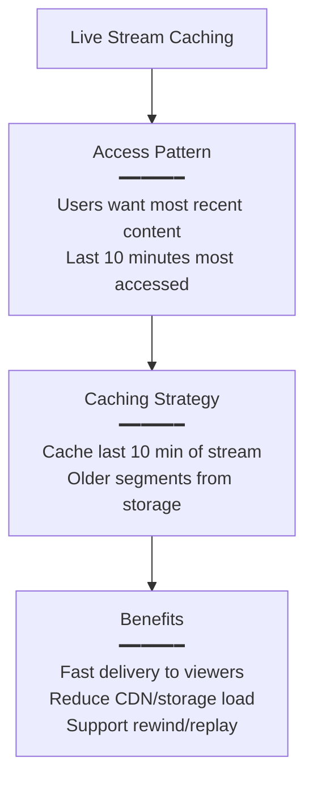

**Why it works:**
- **Predictable access** - Viewers watch "live" = recent content
- **High reuse** - Same segment served to many viewers
- **Temporal locality** - Recent segments accessed most

**Implementation:**

```python
class LiveStreamCache:
    def __init__(self):
        self.cache = {}
        self.segment_duration = 10  # 10 second segments
        self.cache_window = 10 * 60  # Keep 10 minutes
    
    def get_segment(self, stream_id, timestamp):
        cache_key = f"stream:{stream_id}:{timestamp}"
        
        # Check cache
        if cache_key in self.cache:
            return self.cache[cache_key]
        
        # Cache miss - fetch from storage
        segment = storage.get_segment(stream_id, timestamp)
        
        # Cache if recent (within 10 min window)
        current_time = time.time()
        if current_time - timestamp < self.cache_window:
            self.cache[cache_key] = segment
        
        return segment
    
    def add_segment(self, stream_id, timestamp, segment):
        """Called when new segment is generated"""
        cache_key = f"stream:{stream_id}:{timestamp}"
        self.cache[cache_key] = segment
        
        # Clean up old segments
        self.cleanup_old_segments(stream_id, timestamp)
    
    def cleanup_old_segments(self, stream_id, current_timestamp):
        """Remove segments older than 10 minutes"""
        cutoff = current_timestamp - self.cache_window
        
        keys_to_remove = [
            key for key in self.cache.keys()
            if key.startswith(f"stream:{stream_id}:")
            and int(key.split(":")[-1]) < cutoff
        ]
        
        for key in keys_to_remove:
            del self.cache[key]
```

**Benefits:**
- Viewers get instant playback
- Can rewind up to 10 minutes without hitting storage
- CDN serves from edge cache
- Origin server load reduced dramatically

---

## **Caching Best Practices**

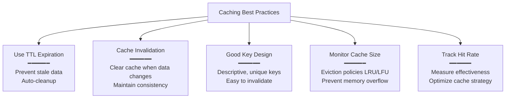

### **1. Use TTL (Time To Live)**

```python
# Good - with expiration
cache.setex("user:123", ttl=300, value=user_data)  # 5 minutes

# Bad - no expiration, can become stale
cache.set("user:123", user_data)
```

### **2. Cache Invalidation**

```python
def update_user_profile(user_id, new_data):
    # Update database
    database.update("UPDATE users SET ... WHERE id = ?", user_id)
    
    # Invalidate cache - CRITICAL!
    cache.delete(f"user:profile:{user_id}")
```

### **3. Good Key Design**

```python
# Good - descriptive, hierarchical
"user:profile:123"
"article:content:456"
"stream:live:abc:segment:12345"

# Bad - unclear, hard to manage
"u123"
"data456"
"x"
```

---

## **Key Takeaways**

✅ **Caches avoid expensive operations** - Network I/O, Disk I/O, or Computation

✅ **Performance improvement** - Primary benefit is speed

✅ **Common use cases:**
- API response caching
- Database query results
- Computational results
- File content

✅ **Check cache FIRST** - Always check cache before expensive operation

✅ **Not all data is cached** - Only frequently accessed subset due to cost

✅ **Caches are faster and expensive** - RAM is faster but costly

✅ **Not just RAM** - Any "nearer" storage that avoids something expensive is a cache

✅ **Just glorified hash tables** - Simple key-value data structure

✅ **Real-world examples:**
- Google News (recent articles)
- Auth tokens (every request)
- Live streams (last 10 minutes)

✅ **Cache selectively** - Focus on frequently accessed, expensive-to-compute data

✅ **Use TTL** - Prevent stale data with expiration

✅ **Invalidate properly** - Clear cache when underlying data changes

**Remember:** Caching is one of the most effective performance optimizations. When used correctly, it can reduce response times from hundreds of milliseconds to single-digit milliseconds!
