# Detailed Notes: How to Know You've Built a Good System

## **Core Philosophy on System Evolution**

**Key Insight:** Every system is **"infinitely" buildable** - you can always add more features, more components, more optimizations. The critical skill is knowing **when to stop the evolution**.

**The Question:** How do you know that you have built a "good" system?

---

## **The 4 Pointers to Building a Good System**

### **Pointer 1: You Broke Your System Into Components**

The first indicator of a well-designed system is proper decomposition into logical components.

**Example: Feed System**

**Component Breakdown:**
- **Webserver** - Handles user requests
- **Generator** - Creates feed content  
- **Aggregator** - Combines and ranks content
- **Database** - Stores feed data

---

### **Pointer 2: Every Component Has a Clear Set of Responsibilities** ⭐ *Exclusive*

Each component must have **well-defined, non-overlapping responsibilities**. This is crucial for maintainability and scalability.

**Example: Feed Component Responsibilities**

#### **Feed Webserver**
- **Responsibility:** Serves feed over HTTP
- **Handles:** Posts, friends data, recommendations²
- **Interface:** User-facing HTTP endpoints

#### **Feed Generator** 
- **Responsibility:** Pulls data from multiple services and puts them in DB
- **Creates:** Candidate feed items
- **Sources:** Aggregates from Post Service, Recommendation Service, Follow Service, etc.

#### **Feed Aggregator**
- **Responsibility:** Combines candidate items fetched by generator
- **Actions:**
  - Filters out redundant items
  - Ranks items by relevance/engagement
  - Creates a final consumable feed
- **Output:** Optimized, personalized feed ready for consumption

**Mermaid Diagram: Feed System with Responsibilities**

```mermaid
graph TB
    User((User)) <--> WS[Webserver<br/>━━━━━━<br/>Serves feed over HTTP]
    
    subgraph FeedSystem["Feed System"]
        WS <--> DB[(Database)]
        
        GEN[Generator<br/>━━━━━━<br/>Pulls data from<br/>multiple services<br/>Creates candidate items]
        
        AGG[Aggregator<br/>━━━━━━<br/>Combines candidates<br/>Filters redundant<br/>Ranks by relevance<br/>Final consumable feed]
        
        GEN --> DB
        AGG <--> DB
    end
    
    PostSvc[Post Service] -.-> GEN
    RecommendSvc[Recommendation Service] -.-> GEN
    FollowSvc[Follow Service] -.-> GEN
    
```

---

### **Pointer 3: For Each Component, You've Got Slight Technical Details Figured Out**

For **every component**, you must address these **4 critical factors:**

#### **1. Database and Caching**
- What data needs to be stored?
- SQL vs. NoSQL choice?
- Caching strategy (Redis, Memcached)?
- Cache invalidation approach?
- Data consistency requirements?

#### **2. Scaling & Fault Tolerance**
- Horizontal scalability strategy?
- Load balancing approach?
- Redundancy and replication?
- Recovery plan in case of failure?
- Circuit breaker patterns?

#### **3. Async Processing (Delegation)**
- What can be done asynchronously?
- Message queues needed? (Kafka, RabbitMQ, SQS)
- Background job processing?
- Event-driven architecture?

#### **4. Communication**
- How do components communicate?
- REST? gRPC? GraphQL?
- Synchronous vs. Asynchronous?
- API contracts and versioning?

**Important:** These 4 factors must be considered for **each sub-component individually**.

---

### **Pointer 4: Each Component (In Isolation) Is Well-Architected**

Every component, when examined **in isolation**, should possess these three qualities:

#### **Scalable** → Horizontally Scalable
- Can add more instances to handle increased load
- **Focus:** Mostly data scalability*
- Stateless design where possible
- Partitioning and sharding strategies

#### **Fault Tolerant** → Plan for Recovery
- Has a recovery plan in case of failure
- Can recover **to a stable state**
- Graceful degradation
- Data consistency maintained during failures

#### **Available** → Functions Even When Dependencies Fail
- Component continues to function even when some other component "fails"
- Circuit breakers prevent cascading failures
- Fallback mechanisms in place
- Graceful handling of downstream failures

---

## **Complete System Design Diagram**

```mermaid
graph TB
    User((User)) <--> WS[Web Server<br/>━━━━━━<br/>✓ Scalable<br/>✓ Fault Tolerant<br/>✓ Available]
    
    subgraph FeedComponent["Feed Component"]
        WS <--> Cache[(Cache<br/>Redis)]
        WS <--> DB[(Feed<br/>Database)]
        
        GEN[Generator<br/>━━━━━━<br/>• Pulls from services<br/>• Creates candidates<br/>━━━━━━<br/>✓ Scalable<br/>✓ Fault Tolerant<br/>✓ Available]
        
        AGG[Aggregator<br/>━━━━━━<br/>• Combines & filters<br/>• Ranks items<br/>• Final feed<br/>━━━━━━<br/>✓ Scalable<br/>✓ Fault Tolerant<br/>✓ Available]
        
        GEN --> DB
        AGG <--> DB
        AGG --> Cache
    end
    
    PS[Post Service] -->|Async| MQ1[Message Queue]
    RS[Recommendation Service] -->|Async| MQ2[Message Queue]
    FS[Follow Service] -->|Async| MQ3[Message Queue]
    
    MQ1 --> GEN
    MQ2 --> GEN
    MQ3 --> GEN
    
```

---

## **The Approach: Structured and Detailed**

**This is precisely how we would tackle EVERY SINGLE SYSTEM:**
- ✅ **Structured** - Follow the systematic breakdown
- ✅ **Detailed** - Consider all technical aspects
- ✅ **Comprehensive** - Address all 4 factors for each component
- ✅ **Isolated** - Ensure each component is independently robust

---

## **Quality Checklist: "Good System" Indicators**

| Indicator | What to Check |
|-----------|---------------|
| **✓ Component Breakdown** | System is decomposed into logical, manageable components |
| **✓ Clear Responsibilities** | Each component has exclusive, well-defined responsibilities |
| **✓ Technical Details** | All 4 factors addressed for every component (DB/Cache, Scaling, Async, Communication) |
| **✓ Isolation Properties** | Each component is independently scalable, fault-tolerant, and available |
| **✓ Stopping Point** | You know when to stop adding complexity and ship the system |

---

## **When to Stop Evolving**

Since every system is "infinitely buildable," knowing **when to stop** is critical:

**Stop when:**
1. All core components are defined with clear responsibilities
2. Each component has the 4 technical factors addressed
3. Each component is scalable, fault-tolerant, and available in isolation
4. The system meets current requirements and near-future scale
5. Adding more complexity doesn't add proportional value

**Don't stop just because:**
- The diagram looks complex (complexity should match problem complexity)
- You've spent a lot of time (time spent ≠ quality)
- It "feels done" (use the 4 pointers as objective criteria)

---

## **Key Takeaways**

🎯 **Use the 4 Pointers as Your Guide:**
1. Break into components
2. Define clear responsibilities (exclusive!)
3. Address 4 technical factors for each
4. Ensure isolation properties for each

📊 **This approach works for EVERY system** - it's the universal structured method

🛑 **Know when to stop** - Don't fall into the trap of infinite building

💡 **Quality over quantity** - A well-architected smaller system beats a poorly designed complex one
