# Detailed Notes: Relational Databases

## **Why Databases Are Critical**

**Fundamental Truth:** Databases are the **most critical component** of any system. They literally **make or break a system**.

### **How Data is Organized**
- Data is **stored & represented in rows and columns**
- This tabular structure forms the foundation of relational databases

---

## **History of Relational Databases**

### **The Evolution Path**
**Computers → Internet → Blockchain**

**Key Historical Insight:** Everything "revolutionary" starts with **Financial Applications**!

### **The Origin Story**


**The Journey:**
1. **Financial needs** required precise tracking of money
2. **Accounting** emerged as the practice
3. **Ledgers** were created (physical books with rows and columns)
4. **Computers** automated this process
5. **Databases were developed to support accounting**

**Result:** Computers first did "accounting" → ledgers → Rows & Columns format

---

## **5 Key Properties That Led to Relational Databases**

Because databases were developed for critical financial applications, they needed these essential properties:

### **1. Data Consistency**
Data must always be accurate and valid across the system

### **2. Data Durability** 
Once data is saved, it must survive system failures and outages

### **3. Data Integrity**
Data must remain accurate, complete, and trustworthy throughout its lifecycle

### **4. Constraints**
Rules must be enforced to maintain data validity (e.g., foreign keys, unique constraints)

### **5. Everything in One Place**
Centralized storage ensures single source of truth

---

## **The Solution: ACID Transactions**

**Because of these requirements, relational databases provide "Transactions"!**

```mermaid
graph TB
    subgraph ACID["ACID Properties"]
        A[Atomicity<br/>━━━━━━<br/>All or Nothing]
        C[Consistency<br/>━━━━━━<br/>Data Integrity Maintained]
        I[Isolation<br/>━━━━━━<br/>Concurrent Transaction Separation]
        D[Durability<br/>━━━━━━<br/>Changes Persist]
    end
    
    TX[Transaction] --> A
    TX --> C
    TX --> I
    TX --> D
    
    style ACID fill:#1a1a1a,stroke:#888,stroke-width:3px
    style A fill:#2d4a3c,stroke:#4a7c5c,stroke-width:2px
    style C fill:#4a2d3c,stroke:#7c4a5c,stroke-width:2px
    style I fill:#2d3d4a,stroke:#4a6d7c,stroke-width:2px
    style D fill:#4a3d2d,stroke:#7c6d4a,stroke-width:2px
    style TX fill:#3d2d1c,stroke:#7c5d4a,stroke-width:3px
```



---

## **A - Atomicity**

**Definition:** All statements within a transaction take effect **or none**

**Principle:** It's an "all or nothing" operation. Either the entire transaction succeeds, or it's completely rolled back.

### **Example: Publishing a Post**

```sql
START TRANSACTION;

-- Step 1: Insert the post
INSERT INTO posts VALUES (...);

-- Step 2: Update user's post count
UPDATE stats 
SET total_posts = total_posts + 1
WHERE user_id = 100;

COMMIT;
```

**What Happens:**
- **If both operations succeed** → Transaction commits, both changes are saved
- **If ANY operation fails** → Entire transaction rolls back, neither change is saved
- **Result:** You never end up with a post inserted but stats not updated, or vice versa

### **Atomicity Diagram**


---

## **C - Consistency**

**Definition:** Data will **never go incorrect**, no matter what happens

**Tools Provided:**
- **Constraints** (Primary keys, Unique keys, Check constraints)
- **Cascades** (ON DELETE CASCADE, ON UPDATE CASCADE)
- **Triggers** (Automated actions on data changes)

### **Example: Foreign Key Enforcement**

**Scenario:** A foreign key check prevents you from deleting a parent record if child records exist

```mermaid
graph TB
    USER[Users Table<br/>user_id: 100]
    POST1[Posts Table<br/>post_id: 1<br/>user_id: 100]
    POST2[Posts Table<br/>post_id: 2<br/>user_id: 100]
    
    POST1 -.->|Foreign Key| USER
    POST2 -.->|Foreign Key| USER
    
    DELETE[Try to DELETE<br/>user_id 100] --> CHECK{Child records<br/>exist?}
    CHECK -->|Yes| REJECT[❌ Delete Rejected<br/>Data Consistency Maintained]
    CHECK -->|No| ALLOW[✓ Delete Allowed]
    
    style USER fill:#2d4a3c,stroke:#4a7c5c
    style POST1 fill:#2d3d4a,stroke:#4a6d7c
    style POST2 fill:#2d3d4a,stroke:#4a6d7c
    style REJECT fill:#4a2d3c,stroke:#7c4a5c
    style ALLOW fill:#1c3d2d,stroke:#3c7c5c
```



**Note:** This behavior **can be tuned** with cascade options

### **Consistency Guarantee Example**

**Invariant:** `total_posts` in stats table = total number of entries in posts table for that user

**The database ensures:**
```
total_posts (in stats) = COUNT(*) FROM posts WHERE user_id = X
```

You have the **necessary tools** to ensure that your data **never goes inconsistent**.

---

## **I - Isolation**

**Definition:** When multiple transactions are executing **parallelly**, the isolation level determines how much changes of one transaction are visible to other transactions.

### **The Core Question**

```mermaid
graph TB
    subgraph TXN1[Transaction 1]
        T1_OP1[Read Data]
        T1_OP2[Modify Data]
        T1_OP3[Write Data]
        T1_COMMIT[COMMIT]
        
        T1_OP1 --> T1_OP2
        T1_OP2 --> T1_OP3
        T1_OP3 --> T1_COMMIT
    end
    
    subgraph TXN2[Transaction 2]
        T2_OP1[Read Data]
        T2_OP2[Modify Data]
        T2_OP3[Write Data]
        T2_COMMIT[COMMIT]
        
        T2_OP1 --> T2_OP2
        T2_OP2 --> T2_OP3
        T2_OP3 --> T2_COMMIT
    end
    
    QUESTION["🤔 Should changes done at<br/>this point in Txn1 be<br/>visible to Txn2<br/>BEFORE Txn1 commits?"]
    
    T1_OP3 -.-> QUESTION
    QUESTION -.-> T2_OP1
    
    style TXN1 fill:#2d1c1c,stroke:#7c4a4a,stroke-width:2px
    style TXN2 fill:#1c2d2d,stroke:#4a7c7c,stroke-width:2px
    style QUESTION fill:#3d2d1c,stroke:#7c5d4a,stroke-width:3px
    style T1_OP3 fill:#4a2d3c,stroke:#7c4a5c
    style T2_OP1 fill:#2d4a3c,stroke:#4a7c5c
```



### **Isolation Levels Timeline**

```mermaid
graph LR
    subgraph Timeline["Parallel Execution Timeline"]
        direction LR
        
        T1_START["Txn1<br/>START"] --> T1_READ["Txn1<br/>READ"]
        T1_READ --> T1_WRITE["Txn1<br/>✏️ WRITE"]
        T1_WRITE --> T1_MORE["Txn1<br/>More Ops..."]
        T1_MORE --> T1_COMMIT["Txn1<br/>COMMIT"]
        
        T2_START["Txn2<br/>START"] --> T2_READ["Txn2<br/>READ"]
        T2_READ --> T2_WRITE["Txn2<br/>✏️ WRITE"]
        T2_WRITE --> T2_COMMIT["Txn2<br/>COMMIT"]
    end
    
    CRITICAL["❓ At this point,<br/>should Txn2 see<br/>Txn1's changes?"]
    
    T1_WRITE -.->|Critical Point| CRITICAL
    CRITICAL -.-> T2_READ
    
    style T1_WRITE fill:#4a2d3c,stroke:#7c4a5c,stroke-width:3px
    style T2_READ fill:#2d4a3c,stroke:#4a7c5c,stroke-width:3px
    style CRITICAL fill:#3d2d1c,stroke:#7c5d4a,stroke-width:3px
    style Timeline fill:#1a1a1a,stroke:#666,stroke-width:2px
```



**The isolation level determines the answer to this question.**

### **Common Isolation Levels** (from least to most isolated)

1. **Read Uncommitted** - Can see uncommitted changes from other transactions (dirty reads)
2. **Read Committed** - Only sees committed changes (most common default)
3. **Repeatable Read** - Ensures consistent reads throughout transaction
4. **Serializable** - Complete isolation, as if transactions ran sequentially

---

## **D - Durability**

**Definition:** When a transaction **commits**, the changes **outlive outages**

**Guarantee:** Once you receive a commit acknowledgment, the data is guaranteed to be persisted even if:
- The system crashes immediately after
- Power fails
- Hardware fails
- Any other catastrophic event occurs

### **Durability Timeline**

```mermaid
graph TB
    START[Start Transaction] --> OPS[Perform Operations]
    OPS --> COMMIT[COMMIT Transaction]
    COMMIT --> ACK[✓ Commit Acknowledged]
    
    ACK --> PERSIST[Changes Written to<br/>Persistent Storage]
    
    PERSIST --> EVENT1{System Crash?}
    EVENT1 -->|Yes| SAFE1[Data Survives ✓]
    EVENT1 -->|No| CONTINUE[System Running]
    
    CONTINUE --> EVENT2{Power Failure?}
    EVENT2 -->|Yes| SAFE2[Data Survives ✓]
    EVENT2 -->|No| NORMAL[Normal Operations]
    
    NORMAL --> EVENT3{Hardware Failure?}
    EVENT3 -->|Yes| SAFE3[Data Survives ✓]
    EVENT3 -->|No| SAFE4[Data Persists ✓]
    
    style COMMIT fill:#2d4a3c,stroke:#4a7c5c,stroke-width:3px
    style ACK fill:#1c3d2d,stroke:#3c7c5c,stroke-width:3px
    style PERSIST fill:#2d4a3c,stroke:#4a7c5c
    style SAFE1 fill:#1c3d2d,stroke:#3c7c5c
    style SAFE2 fill:#1c3d2d,stroke:#3c7c5c
    style SAFE3 fill:#1c3d2d,stroke:#3c7c5c
    style SAFE4 fill:#1c3d2d,stroke:#3c7c5c
```



**Implementation:** Typically achieved through:
- Write-Ahead Logging (WAL)
- Transaction logs
- Disk flushes
- Replication

---

## **When to Use Relational Databases**

### **Remember This Key Principle:**

> **You pick relational databases for RELATIONS and ACID**


**Use Cases Perfect for Relational Databases:**
- Financial systems (transactions, accounting)
- E-commerce (orders, inventory, payments)
- Social networks (users, relationships, posts)
- Any system requiring data integrity and complex relationships

---

## **Practical Exercise**

### **Exercise: Build a Social Network Database**

**Tasks:**

#### **1. Setup a SQL Database**
Choose either:
- MySQL
- PostgreSQL

#### **2. Create a Schema for a Social Network**

Define tables and relationships for:
- **users** - User account information
- **posts** - User-generated content
- **profile** - User profile details
- **photos** - Image uploads
- **following** - User relationships (who follows whom)

**Key Requirements:**
- Define all **relationships** between tables
- Set up appropriate **foreign keys**
- Add necessary **constraints**
- Consider **indexes** for performance

#### **3. Insert Data in One Transaction**

Create a transaction that:
- Inserts a new user
- Creates their profile
- Maintains consistency between both tables

**Example Structure:**
```sql
START TRANSACTION;

INSERT INTO users (username, email, created_at) 
VALUES ('john_doe', 'john@example.com', NOW());

INSERT INTO profile (user_id, full_name, bio)
VALUES (LAST_INSERT_ID(), 'John Doe', 'Software Engineer');

COMMIT;
```

---

## **Complete ACID Architecture Diagram**

```mermaid
graph TB
    subgraph APP[Application Layer]
        CLIENT[Client Application]
    end
    
    subgraph DB[Relational Database]
        TXN_MGR[Transaction Manager]
        
        subgraph ACID_IMPL[ACID Implementation]
            A_IMPL[Atomicity Engine<br/>━━━━━━<br/>• All-or-nothing<br/>• Rollback support]
            
            C_IMPL[Consistency Engine<br/>━━━━━━<br/>• Constraints<br/>• Triggers<br/>• Foreign Keys]
            
            I_IMPL[Isolation Engine<br/>━━━━━━<br/>• Lock management<br/>• MVCC<br/>• Isolation levels]
            
            D_IMPL[Durability Engine<br/>━━━━━━<br/>• WAL<br/>• Disk persistence<br/>• Replication]
        end
        
        STORAGE[(Persistent Storage)]
    end
    
    CLIENT -->|Begin Transaction| TXN_MGR
    TXN_MGR --> A_IMPL
    TXN_MGR --> C_IMPL
    TXN_MGR --> I_IMPL
    TXN_MGR --> D_IMPL
    
    A_IMPL --> STORAGE
    C_IMPL --> STORAGE
    I_IMPL --> STORAGE
    D_IMPL --> STORAGE
    
    style APP fill:#1a1a1a,stroke:#888,stroke-width:2px
    style DB fill:#2d2d2d,stroke:#888,stroke-width:3px
    style ACID_IMPL fill:#1a1a1a,stroke:#666,stroke-width:2px
    style TXN_MGR fill:#3d2d1c,stroke:#7c5d4a,stroke-width:2px
    style A_IMPL fill:#2d4a3c,stroke:#4a7c5c
    style C_IMPL fill:#4a2d3c,stroke:#7c4a5c
    style I_IMPL fill:#2d3d4a,stroke:#4a6d7c
    style D_IMPL fill:#4a3d2d,stroke:#7c6d4a
    style STORAGE fill:#333,stroke:#666
```



---

## **Key Takeaways**

✅ **Databases make or break systems** - They are the most critical component  
✅ **Born from finance** - Relational databases were created to handle money accurately  
✅ **ACID is the foundation** - These four properties ensure data reliability  
✅ **Use for relations and ACID** - Choose relational DBs when you need either or both  
✅ **Transactions are powerful** - They provide guarantees that prevent data corruption  
✅ **Consistency is enforced** - Constraints, triggers, and foreign keys maintain data integrity  

**Final Wisdom:** When financial accuracy matters, when relationships between data matter, when you can't afford to lose or corrupt data - relational databases with ACID properties are your answer.
