# Detailed Notes: Isolation Levels in Databases

## **Introduction to Isolation Levels**

**Core Concept:** Relational databases provide **ACID guarantees**, and the **"I" in ACID is Isolation**. Isolation levels help us **tune** how transactions interact with each other.

### **What Isolation Levels Control**


**Definition:** Isolation levels **dictate how much one transaction knows about the other** when multiple transactions are executing parallelly.

---

## **The Four Standard Isolation Levels**

From **least isolated** to **most isolated**:

1. **Read Uncommitted** (Dirty Reads) - Least isolation
2. **Read Committed** (Default in most DBs) - Moderate isolation
3. **Repeatable Read** (MySQL default) - Strong isolation
4. **Serializable** - Maximum isolation


---

## **1. Repeatable Read** (MySQL Default)

### **Definition**
**Consistent reads within the same transaction** - even if another transaction commits changes, you won't see them if you've already read that value.

### **Behavior**
- Once you read a value in a transaction, subsequent reads return the **same value**
- Changes made by other transactions are **NOT visible** even after they commit
- **Snapshot isolation** - transaction sees a consistent snapshot of the database

### **Practical Example**


### **MySQL Demo**

**Check Isolation Level:**
```sql
mysql> SELECT @@transaction_ISOLATION;
+-------------------------+
| @@transaction_ISOLATION |
+-------------------------+
| REPEATABLE-READ         |
+-------------------------+
```

**Scenario:**

**Terminal 1 (T1):**
```sql
SET autocommit=0;
START TRANSACTION;
SELECT * FROM users WHERE id = 1;
-- Returns: id=1, name='a'

-- Update the name
UPDATE users SET name='a_t1' WHERE id=1;
COMMIT;
```

**Terminal 2 (T2):**
```sql
SET autocommit=0;
START TRANSACTION;
SELECT * FROM users WHERE id = 1;
-- Returns: id=1, name='a'

-- Wait for T1 to commit...

-- Read again AFTER T1 commits
SELECT * FROM users WHERE id = 1;
-- STILL returns: id=1, name='a'
-- NOT 'a_t1' because we already read this row!
```

### **Pros & Cons**

**✅ Pros:**
- **Consistent reads** within a transaction
- Prevents non-repeatable reads
- Good for reporting and analytics

**❌ Cons:**
- Can lead to **phantom reads** in some cases
- Transaction sees stale data if other transactions commit changes

---

## **2. Read Committed** (Most Common Default)

### **Definition**
Reads within the same transaction **always read fresh/committed values** from other transactions.

### **Behavior**
- Only sees **committed** data (no dirty reads)
- Each read gets the **latest committed value**
- Different reads within the same transaction can return different values

### **Practical Example**


### **Pros & Cons**

**✅ Pros:**
- Always reads **fresh, committed data**
- Better for real-time systems
- Less blocking than higher isolation levels

**❌ Cons:**
- **Multiple reads within same transaction are inconsistent**
- Can lead to non-repeatable reads
- Not suitable for operations requiring consistent snapshots

### **Use Case Example**

**Problem Scenario:**
```sql
START TRANSACTION;

-- Read 1: Get account balance
SELECT balance FROM accounts WHERE id = 123;  -- Returns: 1000

-- Another transaction updates and commits here...

-- Read 2: Calculate interest based on balance
SELECT balance FROM accounts WHERE id = 123;  -- Returns: 1500

-- Inconsistency! Same transaction, different values!
```

---

## **3. Read Uncommitted** (Dirty Reads)

### **Definition**
Reads **even uncommitted values** from other transactions. This is known as a **"dirty read"**.

### **Behavior**
- Can see changes from transactions that **haven't committed yet**
- If the other transaction rolls back, you saw data that never existed
- **Lowest isolation level** - highest performance

### **Practical Example**


### **Dangers of Dirty Reads**

**Scenario:**
```sql
-- Transaction 1
START TRANSACTION;
UPDATE products SET price = 50 WHERE id = 1;  -- Originally 100
-- Not committed yet...

-- Transaction 2 (READ UNCOMMITTED)
START TRANSACTION;
SELECT price FROM products WHERE id = 1;  -- Reads: 50 (dirty!)
-- Makes business decision based on price = 50

-- Transaction 1
ROLLBACK;  -- Price goes back to 100!

-- Transaction 2 made decisions based on data that never existed!
```

### **Pros & Cons**

**✅ Pros:**
- **Highest performance** (no locking for reads)
- Useful for non-critical, approximate data
- Good for dashboards showing rough estimates

**❌ Cons:**
- **Dirty reads** - can see data that gets rolled back
- Data integrity risks
- Should **rarely be used** in production

### **When to Use**

- Analytics dashboards where exact accuracy isn't critical
- Approximate counts or statistics
- Read-only reporting on non-critical data

---

## **4. Serializable** (Maximum Isolation)

### **Definition**
Every read is a **locking read**, and while one transaction reads, **others will have to wait**.

### **Behavior**
- Transactions appear to execute **serially** (one after another)
- Reads acquire **locks** on data
- Other transactions must wait for locks to be released
- **Complete isolation** - no concurrency issues

### **Implementation Note**
⚠️ **Depends on storage engine** - Implementation can vary by database engine, so **read documentation before you alter** the isolation level.

### **Practical Example**



```mermaid
sequenceDiagram
    participant T1 as Transaction 1
    participant DB as Database<br/>(with Locks)
    participant T2 as Transaction 2
    
    T1->>DB: START TRANSACTION
    T2->>DB: START TRANSACTION
    
    T1->>DB: SELECT * (LOCKING READ)
    DB-->>T1: Returns data + LOCK acquired 🔒
    
    T2->>DB: SELECT * (tries to read)
    Note over T2: BLOCKED ⏸️<br/>Waiting for T1's lock
    
    Note over T1: T1 processes data...
    
    T1->>DB: COMMIT
    DB->>DB: Release lock 🔓
    
    DB-->>T2: Now proceeds with read
    T2->>DB: COMMIT
```

### **Locking Behavior**

**Transaction 1:**
```sql
SET TRANSACTION ISOLATION LEVEL SERIALIZABLE;
START TRANSACTION;

-- This acquires a lock
SELECT * FROM orders WHERE customer_id = 100;

-- Do some processing...

COMMIT;  -- Lock released
```

**Transaction 2:**
```sql
SET TRANSACTION ISOLATION LEVEL SERIALIZABLE;
START TRANSACTION;

-- This will WAIT until T1 commits
SELECT * FROM orders WHERE customer_id = 100;
-- Blocked here... ⏸️

COMMIT;
```

### **Pros & Cons**

**✅ Pros:**
- **Complete isolation** - no concurrency anomalies
- Guaranteed consistency
- Prevents all read phenomena (dirty, non-repeatable, phantom)

**❌ Cons:**
- **Significant performance impact** due to locking
- **Reduced concurrency** - transactions wait for each other
- Can lead to **deadlocks**
- Should only be used when absolutely necessary

### **When to Use**

- Financial transactions requiring absolute accuracy
- Critical operations where consistency is paramount
- Situations where data integrity cannot be compromised

---

## **Comparison Table**

| Isolation Level | Dirty Reads | Non-Repeatable Reads | Phantom Reads | Locking | Performance |
|----------------|-------------|---------------------|---------------|---------|-------------|
| **Read Uncommitted** | ✓ Possible | ✓ Possible | ✓ Possible | Minimal | ⚡ Highest |
| **Read Committed** | ❌ Prevented | ✓ Possible | ✓ Possible | Moderate | ⚡⚡ High |
| **Repeatable Read** | ❌ Prevented | ❌ Prevented | ✓ Possible | More | ⚡⚡⚡ Moderate |
| **Serializable** | ❌ Prevented | ❌ Prevented | ❌ Prevented | Maximum | ⚡⚡⚡⚡ Lowest |

---

## **Complete Isolation Levels Diagram**

```mermaid
graph TB
    subgraph IsolationLevels["Isolation Levels Spectrum"]
        RU[Read Uncommitted<br/>━━━━━━━━━━<br/>🔓 No locks on reads<br/>✓ Dirty reads possible<br/>✓ Non-repeatable reads<br/>✓ Phantom reads<br/>⚡ Best performance]
        
        RC[Read Committed<br/>━━━━━━━━━━<br/>🔒 Short locks<br/>❌ No dirty reads<br/>✓ Non-repeatable reads<br/>✓ Phantom reads<br/>⚡⚡ Good performance]
        
        RR[Repeatable Read<br/>━━━━━━━━━━<br/>🔒 Snapshot isolation<br/>❌ No dirty reads<br/>❌ No non-repeatable reads<br/>✓ Phantom reads possible<br/>⚡⚡⚡ Moderate performance]
        
        S[Serializable<br/>━━━━━━━━━━<br/>🔒 Full locking<br/>❌ No dirty reads<br/>❌ No non-repeatable reads<br/>❌ No phantom reads<br/>⚡⚡⚡⚡ Lower performance]
    end
    
    RU -->|More Isolation| RC
    RC -->|More Isolation| RR
    RR -->|More Isolation| S
    
    style IsolationLevels fill:#1a1a1a,stroke:#888,stroke-width:3px
    style RU fill:#4a2d2d,stroke:#7c4a4a,stroke-width:2px
    style RC fill:#3d3d2d,stroke:#6d6d4a,stroke-width:2px
    style RR fill:#2d3d3d,stroke:#4a6d6d,stroke-width:2px
    style S fill:#2d2d4a,stroke:#4a4a7c,stroke-width:2px
```



---

## **Read Phenomena Explained**

### **1. Dirty Read**
Reading uncommitted data from another transaction that may get rolled back.

### **2. Non-Repeatable Read**
Reading the same row twice in a transaction returns different values because another transaction modified and committed it.

### **3. Phantom Read**
Re-running the same query returns a different set of rows because another transaction inserted or deleted rows.

---

## **Practical Guidelines**

### **Choosing the Right Isolation Level**


### **Default Isolation Levels**

- **MySQL/MariaDB**: REPEATABLE READ
- **PostgreSQL**: READ COMMITTED
- **SQL Server**: READ COMMITTED
- **Oracle**: READ COMMITTED

### **Setting Isolation Levels**

**Session Level:**
```sql
-- MySQL
SET SESSION TRANSACTION ISOLATION LEVEL REPEATABLE READ;

-- PostgreSQL
SET TRANSACTION ISOLATION LEVEL READ COMMITTED;
```

**Transaction Level:**
```sql
SET TRANSACTION ISOLATION LEVEL SERIALIZABLE;
START TRANSACTION;
-- Your queries here
COMMIT;
```

**Global Level (MySQL):**
```sql
SET GLOBAL TRANSACTION ISOLATION LEVEL READ COMMITTED;
```

---

## **Performance Impact**


---

## **Key Takeaways**

✅ **Isolation levels control transaction visibility** - They determine what one transaction can see from another

✅ **Trade-off between consistency and performance** - Higher isolation = more consistency but lower performance

✅ **Engine-dependent implementation** - Always check your database's documentation for specific behavior

✅ **Choose based on use case:**
- **Read Uncommitted**: Non-critical analytics, approximate data
- **Read Committed**: General-purpose applications (most common)
- **Repeatable Read**: Consistent snapshots, reporting
- **Serializable**: Critical financial transactions, absolute consistency required

✅ **Default isn't always right** - Understand your application's needs and choose accordingly

✅ **Test thoroughly** - Isolation level bugs are subtle and can lead to data inconsistencies

⚠️ **Warning**: Always read your database engine's documentation before altering isolation levels, as implementation details can vary significantly between different storage engines and databases.
