# Detailed Notes: Scaling Databases

## **Why Database Scaling Matters**

**Critical Truth:** Databases are the **most important component** of any system out there. They literally **make or break any system**.

```mermaid
graph TB
    DB[Database Performance]
    
    DB --> MAKE[✓ Makes Systems<br/>━━━━━━<br/>• Fast responses<br/>• Happy users<br/>• Successful product]
    
    DB --> BREAK[✗ Breaks Systems<br/>━━━━━━<br/>• Slow queries<br/>• Timeouts<br/>• System failure]
    
    style DB fill:#3d2d1c,stroke:#7c5d4a,stroke-width:4px
    style MAKE fill:#1c3d2d,stroke:#3c7c5c,stroke-width:2px
    style BREAK fill:#3d1c2d,stroke:#7c3c5c,stroke-width:2px
```

**Therefore:** It is **critical to understand how to scale them**.

### **Universal Applicability**

⭐ **Important:** These techniques are applicable to **most databases out there** - both:
- **Relational databases** (MySQL, PostgreSQL, etc.)
- **Non-relational databases** (MongoDB, Cassandra, etc.)

⚠️ **Always:** Read your database documentation before implementing scaling strategies.

---

## **Two Primary Scaling Approaches**

```mermaid
graph TB
    SCALE[Database Scaling]
    
    SCALE --> VERT[Vertical Scaling<br/>━━━━━━<br/>Scale Up<br/>Bigger Machine]
    
    SCALE --> HORIZ[Horizontal Scaling<br/>━━━━━━<br/>Scale Out<br/>More Machines]
    
    VERT --> V1[Add CPU]
    VERT --> V2[Add RAM]
    VERT --> V3[Add Disk]
    
    HORIZ --> H1[Read Replicas]
    HORIZ --> H2[Sharding]
    
    style SCALE fill:#1a1a1a,stroke:#888,stroke-width:3px
    style VERT fill:#2d4a3c,stroke:#4a7c5c,stroke-width:2px
    style HORIZ fill:#4a2d3c,stroke:#7c4a5c,stroke-width:2px
    style V1 fill:#2d3d2d,stroke:#5d6d4d
    style V2 fill:#2d3d2d,stroke:#5d6d4d
    style V3 fill:#2d3d2d,stroke:#5d6d4d
    style H1 fill:#3d2d3d,stroke:#6d4d6d
    style H2 fill:#3d2d3d,stroke:#6d4d6d
```

---

## **1. Vertical Scaling (Scale Up)**

### **Definition**
Add more **CPU, RAM, and Disk** to the existing database server - essentially upgrading to a bigger, more powerful machine.

### **How It Works**

```mermaid
graph LR
    subgraph Before["Before Scaling"]
        DB1[Database<br/>━━━━━━<br/>4 CPU<br/>16GB RAM<br/>500GB Disk]
    end
    
    subgraph After["After Scaling"]
        DB2[Database<br/>━━━━━━<br/>16 CPU<br/>64GB RAM<br/>2TB Disk]
    end
    
    Before -->|Vertical Scaling<br/>Upgrade Hardware| After
    
    DOWNTIME[⚠️ Requires Downtime<br/>During Reboot]
    
    Before -.-> DOWNTIME
    
    style DB1 fill:#2d3d4a,stroke:#4a6d7c
    style DB2 fill:#2d4a3c,stroke:#4a7c5c,stroke-width:3px
    style DOWNTIME fill:#4a2d1c,stroke:#7c4a3c,stroke-width:2px
```

### **Characteristics**

**✅ Advantages:**
- **Simple to implement** - just upgrade the server
- **No application changes** needed
- Maintains single database simplicity
- Immediate performance improvement

**❌ Disadvantages:**
- **Requires downtime during reboot** - system goes offline
- **Physical hardware limitation** - can't scale infinitely
- Expensive at higher tiers
- Single point of failure remains

### **Use Cases**
- Early-stage applications
- When you need a quick performance boost
- Systems that can tolerate scheduled downtime
- Before implementing more complex horizontal scaling

---

## **2. Horizontal Scaling: Read Replicas**

### **The 90:10 Principle**

**Key Insight:** In most applications, the **read:write ratio = 90:10**

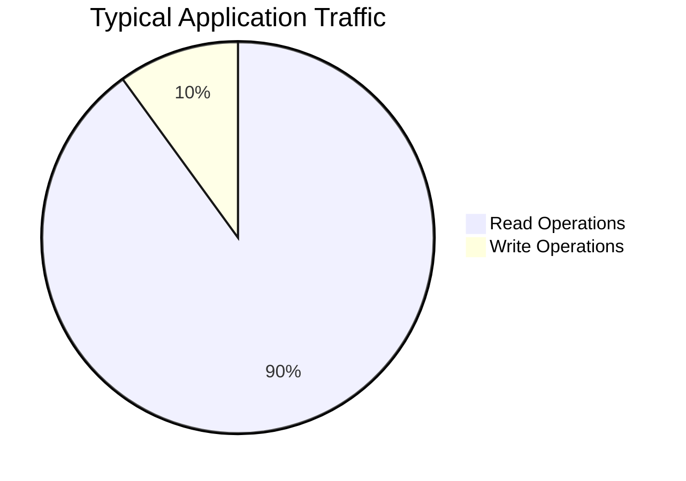

**Strategy:** Move reads to separate database instances (replicas), freeing the master to handle writes efficiently.

### **Architecture**

```mermaid
graph TB
    CLIENT[Client/User]
    API[API Server]
    
    subgraph DBCluster["Database Cluster"]
        MASTER[(Master Database<br/>━━━━━━<br/>Handles ALL Writes)]
        REPLICA1[(Replica 1<br/>━━━━━━<br/>Handles Reads)]
        REPLICA2[(Replica 2<br/>━━━━━━<br/>Handles Reads)]
        
        MASTER -->|SYNC or ASYNC<br/>Replication| REPLICA1
        MASTER -->|SYNC or ASYNC<br/>Replication| REPLICA2
    end
    
    CLIENT <--> API
    
    API -->|Write| MASTER
    API -->|Read| REPLICA1
    API -->|Read| REPLICA2
    
    style MASTER fill:#2d4a3c,stroke:#4a7c5c,stroke-width:3px
    style REPLICA1 fill:#2d3d4a,stroke:#4a6d7c,stroke-width:2px
    style REPLICA2 fill:#2d3d4a,stroke:#4a6d7c,stroke-width:2px
    style API fill:#3d2d1c,stroke:#7c5d4a,stroke-width:2px
    style DBCluster fill:#1a1a1a,stroke:#888,stroke-width:2px
```

### **How Read Replicas Work**

**Flow:**
1. **All writes** go to the **Master** database
2. Master is **free to handle writes** efficiently
3. **Changes are replicated** from Master to Replicas
4. **Reads are distributed** across Replicas
5. **API servers must know** which database to connect to for each operation

### **Routing Responsibility**

**Critical:** API servers **should know which DB to connect to** to get things done:
- **Writes** → Route to Master
- **Reads** → Route to Replicas (with load balancing)

```mermaid
graph TB
    API[API Server<br/>━━━━━━<br/>Routing Logic]
    
    WRITE{Write Operation?}
    READ{Read Operation?}
    
    MASTER[(Master)]
    REPLICA1[(Replica 1)]
    REPLICA2[(Replica 2)]
    
    API --> WRITE
    API --> READ
    
    WRITE -->|Yes| MASTER
    READ -->|Yes| LB[Load Balancer]
    
    LB --> REPLICA1
    LB --> REPLICA2
    
    style API fill:#3d2d1c,stroke:#7c5d4a,stroke-width:3px
    style MASTER fill:#2d4a3c,stroke:#4a7c5c,stroke-width:2px
    style REPLICA1 fill:#2d3d4a,stroke:#4a6d7c
    style REPLICA2 fill:#2d3d4a,stroke:#4a6d7c
    style LB fill:#2d2d4a,stroke:#4a4a7c
```

---

## **Replication: Keeping Data Consistent**

### **The Replication Challenge**

**Problem:** Changes on one database (Master) **need to be sent to Replica to maintain consistency**.

**Solution:** Database replication - two primary modes available.

---

## **1. Synchronous Replication**

### **How It Works**

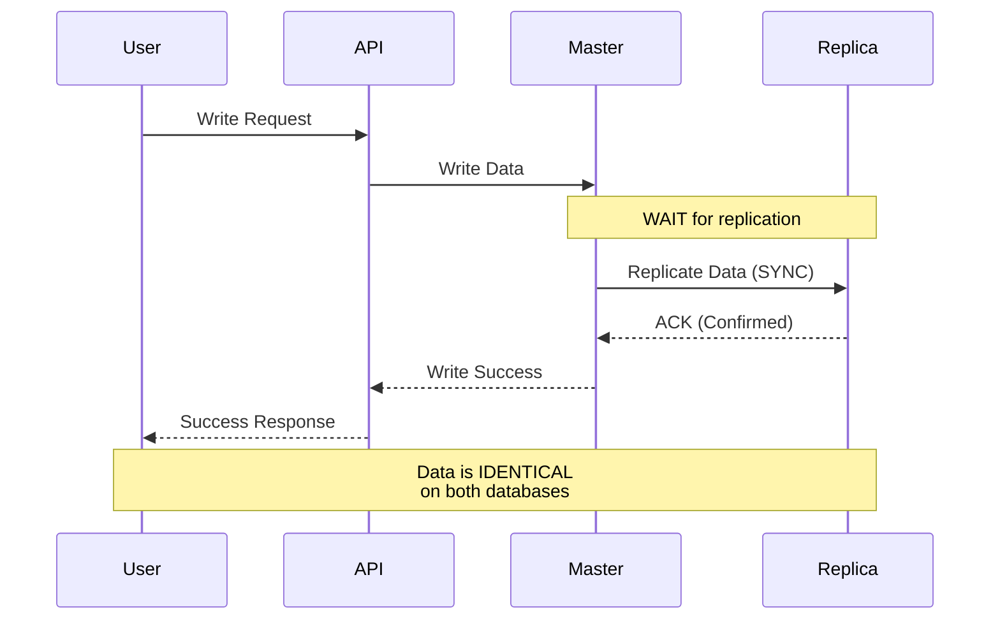

### **Characteristics**

**Data Consistency:**
- ✅ **Strong consistency** - Master and Replica always have identical data
- ✅ **Zero replication lag** - No delay between databases

**Performance Trade-off:**
- ❌ **Slower writes** - Must wait for replica acknowledgment before confirming write
- Write operation blocks until replication completes

### **Visual Flow**

```mermaid
graph LR
    USER[User] -->|w| API[API]
    API -->|w| MASTER[(Master)]
    MASTER -->|w SYNC| REPLICA[(Replica)]
    REPLICA -->|ACK| MASTER
    MASTER -->|Success| API
    API -->|Success| USER
    
    style MASTER fill:#2d4a3c,stroke:#4a7c5c,stroke-width:3px
    style REPLICA fill:#2d3d4a,stroke:#4a6d7c,stroke-width:2px
    style API fill:#3d2d1c,stroke:#7c5d4a
```

### **Use Cases**
- Financial transactions
- Critical data that requires immediate consistency
- Systems where data accuracy is more important than write speed
- Compliance-heavy applications

---

## **2. Asynchronous Replication**

### **How It Works**

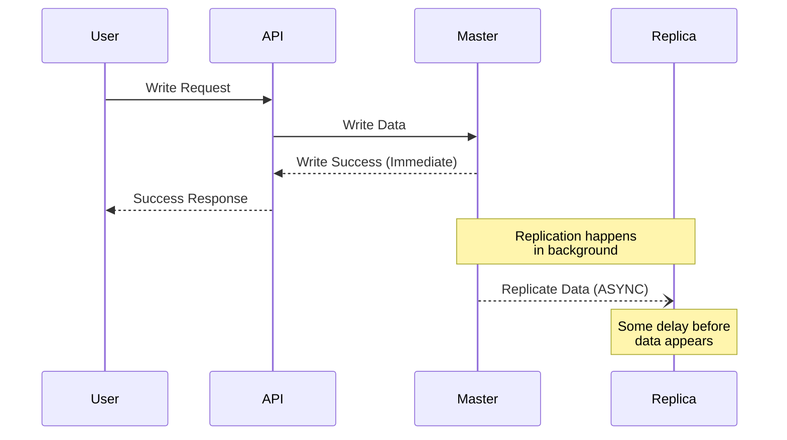

### **Characteristics**

**Data Consistency:**
- ⚠️ **Eventual consistency** - Replica will eventually match Master
- ⚠️ **Some replication lag** - Temporary delay between databases

**Performance Benefit:**
- ✅ **Faster writes** - Don't wait for replica acknowledgment
- Write operation completes immediately after Master confirms

### **Visual Flow**

```mermaid
graph LR
    USER[User] -->|w| API[API]
    API -->|w| MASTER[(Master)]
    MASTER -.->|Async<br/>Replication| REPLICA[(Replica)]
    MASTER -->|Immediate<br/>Success| API
    API -->|Success| USER
    
    style MASTER fill:#2d4a3c,stroke:#4a7c5c,stroke-width:3px
    style REPLICA fill:#2d3d4a,stroke:#4a6d7c,stroke-width:2px
    style API fill:#3d2d1c,stroke:#7c5d4a
```

### **Replication Lag Window**

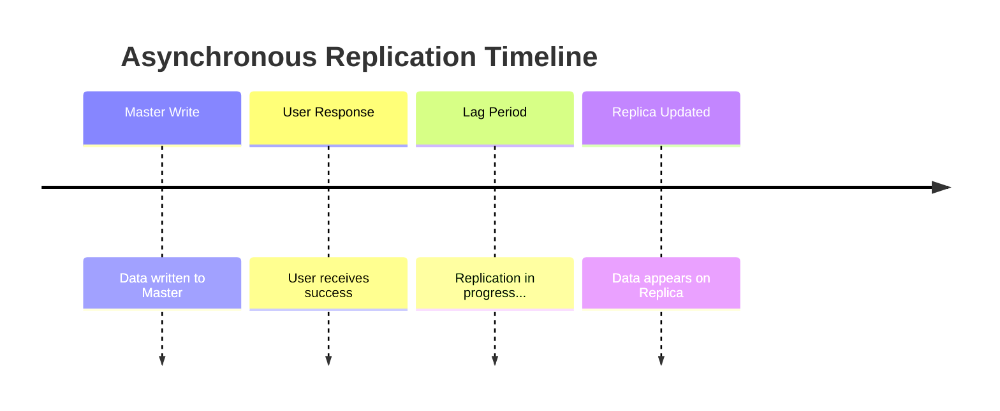

### **Use Cases**
- Social media feeds
- Analytics data
- Logging systems
- Non-critical reads where slight staleness is acceptable
- High-throughput write systems

---

## **Comparison: Sync vs Async Replication**

| Aspect | Synchronous | Asynchronous |
|--------|-------------|--------------|
| **Consistency** | Strong (Immediate) | Eventual (Delayed) |
| **Replication Lag** | Zero | Some lag exists |
| **Write Speed** | Slower | Faster |
| **Data Safety** | Both DBs always in sync | Brief window of inconsistency |
| **Complexity** | Simple guarantee | Need to handle lag |
| **Use Case** | Critical data | High throughput |

---

## **3. Horizontal Scaling: Sharding**

### **The Problem**

**Challenge:** When **one node cannot handle the data/load**, even with replicas, the Master becomes a bottleneck.

**Solution:** Split data into **multiple exclusive subsets** (shards).

### **What is Sharding?**

**Definition:** Distributing data across multiple independent databases where **each database holds a distinct subset** of the total data.

**Key Principle:** Writes on a particular row/document will go to **one particular shard only**.

### **Sharding Architecture**

```mermaid
graph TB
    CLIENT[Client]
    API[API Server<br/>━━━━━━<br/>Routing Logic]
    
    subgraph Shards["Sharded Database Cluster"]
        SHARD1[(Shard 1<br/>━━━━━━<br/>Users 1-1000)]
        SHARD2[(Shard 2<br/>━━━━━━<br/>Users 1001-2000)]
        SHARD3[(Shard 3<br/>━━━━━━<br/>Users 2001-3000)]
    end
    
    CLIENT <--> API
    
    API --> SHARD1
    API --> SHARD2
    API --> SHARD3
    
    style API fill:#3d2d1c,stroke:#7c5d4a,stroke-width:3px
    style SHARD1 fill:#2d4a3c,stroke:#4a7c5c,stroke-width:2px
    style SHARD2 fill:#2d3d4a,stroke:#4a6d7c,stroke-width:2px
    style SHARD3 fill:#4a2d3c,stroke:#7c4a5c,stroke-width:2px
    style Shards fill:#1a1a1a,stroke:#888,stroke-width:2px
```

### **Key Characteristics**

**Independence:**
- ⭐ **Shards are independent** - Each operates autonomously
- ⭐ **No replication between shards** - Each shard has distinct data
- Each write goes to exactly one shard

**Routing:**
- **API server needs to know** whom to connect to get things done
- Uses a **sharding key** (e.g., user_id, customer_id) to determine which shard

**Note:** Some databases have a **proxy that takes care of routing** automatically.

### **Benefits**

**Scalability:**
```mermaid
graph LR
    subgraph Before["Single Database"]
        DB[100% Load<br/>━━━━━━<br/>Overloaded ❌]
    end
    
    subgraph After["3 Shards"]
        S1[~33% Load<br/>━━━━━━<br/>Healthy ✓]
        S2[~33% Load<br/>━━━━━━<br/>Healthy ✓]
        S3[~33% Load<br/>━━━━━━<br/>Healthy ✓]
    end
    
    Before -->|Sharding| After
    
    style DB fill:#4a2d1c,stroke:#7c4a3c,stroke-width:3px
    style S1 fill:#1c3d2d,stroke:#3c7c5c
    style S2 fill:#1c3d2d,stroke:#3c7c5c
    style S3 fill:#1c3d2d,stroke:#3c7c5c
```

**This way, we scale our overall database load** by distributing it across multiple independent nodes.

### **Sharding with Replicas**

**Hybrid Approach:** Each shard can have its **own replica** (if needed) for:
- High availability
- Read scaling within each shard
- Disaster recovery

```mermaid
graph TB
    API[API Server]
    
    subgraph Shard1Group["Shard 1 Group"]
        S1M[(Shard 1<br/>Master)]
        S1R[(Shard 1<br/>Replica)]
        S1M -.->|Replication| S1R
    end
    
    subgraph Shard2Group["Shard 2 Group"]
        S2M[(Shard 2<br/>Master)]
        S2R[(Shard 2<br/>Replica)]
        S2M -.->|Replication| S2R
    end
    
    subgraph Shard3Group["Shard 3 Group"]
        S3M[(Shard 3<br/>Master)]
        S3R[(Shard 3<br/>Replica)]
        S3M -.->|Replication| S3R
    end
    
    API --> S1M
    API --> S1R
    API --> S2M
    API --> S2R
    API --> S3M
    API --> S3R
    
    style API fill:#3d2d1c,stroke:#7c5d4a,stroke-width:3px
    style S1M fill:#2d4a3c,stroke:#4a7c5c,stroke-width:2px
    style S2M fill:#2d4a3c,stroke:#4a7c5c,stroke-width:2px
    style S3M fill:#2d4a3c,stroke:#4a7c5c,stroke-width:2px
    style S1R fill:#2d3d4a,stroke:#4a6d7c
    style S2R fill:#2d3d4a,stroke:#4a6d7c
    style S3R fill:#2d3d4a,stroke:#4a6d7c
```

---

## **Common Sharding Strategies**

### **1. Range-Based Sharding**

Partition data based on ranges of the sharding key.

```mermaid
graph TB
    DATA[User Data]
    
    DATA --> RULE{User ID Range?}
    
    RULE -->|1-1000| S1[(Shard 1)]
    RULE -->|1001-2000| S2[(Shard 2)]
    RULE -->|2001-3000| S3[(Shard 3)]
    
    style S1 fill:#2d4a3c,stroke:#4a7c5c
    style S2 fill:#2d3d4a,stroke:#4a6d7c
    style S3 fill:#4a2d3c,stroke:#7c4a5c
```

**Example:**
- Shard 1: Users 1-1000
- Shard 2: Users 1001-2000
- Shard 3: Users 2001-3000

**Pros:** Simple, easy to add new ranges
**Cons:** Can lead to uneven distribution (hotspots)

### **2. Hash-Based Sharding**

Use a hash function on the sharding key to determine shard.

```mermaid
graph LR
    KEY[User ID: 12345]
    HASH[Hash Function<br/>hash = user_id % 3]
    
    KEY --> HASH
    
    HASH --> RESULT{Result?}
    
    RESULT -->|0| S1[(Shard 1)]
    RESULT -->|1| S2[(Shard 2)]
    RESULT -->|2| S3[(Shard 3)]
    
    style HASH fill:#3d2d1c,stroke:#7c5d4a,stroke-width:2px
    style S1 fill:#2d4a3c,stroke:#4a7c5c
    style S2 fill:#2d3d4a,stroke:#4a6d7c
    style S3 fill:#4a2d3c,stroke:#7c4a5c
```

**Example:**
```
shard_id = hash(user_id) % number_of_shards
```

**Pros:** Even distribution, prevents hotspots
**Cons:** Harder to add/remove shards (resharding required)

### **3. Geographic/Location-Based Sharding**

Partition based on geographic location.

```mermaid
graph TB
    DATA[Global Users]
    
    DATA --> REGION{User Region?}
    
    REGION -->|North America| S1[(US Shard)]
    REGION -->|Europe| S2[(EU Shard)]
    REGION -->|Asia| S3[(APAC Shard)]
    
    style S1 fill:#2d4a3c,stroke:#4a7c5c
    style S2 fill:#2d3d4a,stroke:#4a6d7c
    style S3 fill:#4a2d3c,stroke:#7c4a5c
```

**Pros:** Low latency for users, data sovereignty compliance
**Cons:** Uneven distribution if user base is geographically imbalanced

---

## **Complete Database Scaling Architecture**

```mermaid
graph TB
    USERS[Users/Clients]
    LB[Load Balancer]
    
    subgraph APILayer["API Layer"]
        API1[API Server 1<br/>Routing Logic]
        API2[API Server 2<br/>Routing Logic]
        API3[API Server 3<br/>Routing Logic]
    end
    
    PROXY[Database Proxy<br/>━━━━━━<br/>Shard Routing]
    
    subgraph Shard1["Shard 1: Users 1-1000"]
        S1M[(Master)]
        S1R1[(Replica 1)]
        S1R2[(Replica 2)]
        S1M -.->|Async| S1R1
        S1M -.->|Async| S1R2
    end
    
    subgraph Shard2["Shard 2: Users 1001-2000"]
        S2M[(Master)]
        S2R1[(Replica 1)]
        S2R2[(Replica 2)]
        S2M -.->|Async| S2R1
        S2M -.->|Async| S2R2
    end
    
    subgraph Shard3["Shard 3: Users 2001-3000"]
        S3M[(Master)]
        S3R1[(Replica 1)]
        S3R2[(Replica 2)]
        S3M -.->|Async| S3R1
        S3M -.->|Async| S3R2
    end
    
    USERS --> LB
    LB --> API1
    LB --> API2
    LB --> API3
    
    API1 --> PROXY
    API2 --> PROXY
    API3 --> PROXY
    
    PROXY -->|Writes| S1M
    PROXY -->|Writes| S2M
    PROXY -->|Writes| S3M
    
    PROXY -->|Reads| S1R1
    PROXY -->|Reads| S1R2
    PROXY -->|Reads| S2R1
    PROXY -->|Reads| S2R2
    PROXY -->|Reads| S3R1
    PROXY -->|Reads| S3R2
    
    style APILayer fill:#1a1a1a,stroke:#888,stroke-width:2px
    style PROXY fill:#3d2d1c,stroke:#7c5d4a,stroke-width:3px
    style S1M fill:#2d4a3c,stroke:#4a7c5c,stroke-width:2px
    style S2M fill:#2d4a3c,stroke:#4a7c5c,stroke-width:2px
    style S3M fill:#2d4a3c,stroke:#4a7c5c,stroke-width:2px
```

---

## **Scaling Strategy Decision Tree**

```mermaid
graph TD
    START{Current<br/>Performance<br/>Issue?}
    
    START -->|Simple capacity| VERT[Vertical Scaling<br/>━━━━━━<br/>Add CPU/RAM/Disk]
    
    START -->|Read-heavy<br/>90:10 ratio| REP[Read Replicas<br/>━━━━━━<br/>+ Replication]
    
    START -->|Data too large<br/>for one node| SHARD[Sharding<br/>━━━━━━<br/>Split data]
    
    REP --> REPMODE{Choose<br/>Replication?}
    REPMODE -->|Need strong<br/>consistency| SYNC[Synchronous<br/>Replication]
    REPMODE -->|Need fast<br/>writes| ASYNC[Asynchronous<br/>Replication]
    
    SHARD --> COMBO{Need HA<br/>per shard?}
    COMBO -->|Yes| BOTH[Sharding +<br/>Replicas per Shard]
    COMBO -->|No| JUSTSH[Just Sharding]
    
    style START fill:#3d2d1c,stroke:#7c5d4a,stroke-width:3px
    style VERT fill:#2d4a3c,stroke:#4a7c5c,stroke-width:2px
    style REP fill:#2d3d4a,stroke:#4a6d7c,stroke-width:2px
    style SHARD fill:#4a2d3c,stroke:#7c4a5c,stroke-width:2px
    style BOTH fill:#1c3d2d,stroke:#3c7c5c,stroke-width:2px
```

---

## **Key Takeaways**

✅ **Databases make or break systems** - Scaling is critical

✅ **Two main approaches:**
- **Vertical** = Bigger machine (simple but limited)
- **Horizontal** = More machines (complex but unlimited)

✅ **Read Replicas** for read-heavy workloads (90:10 ratio)

✅ **Replication modes:**
- **Synchronous** = Strong consistency, slower writes
- **Asynchronous** = Eventual consistency, faster writes

✅ **Sharding** when single node can't handle data/load

✅ **Combine strategies** - Sharding + Replicas for maximum scale

✅ **Routing is critical** - API must know which DB to use

✅ **Some DBs have proxies** that handle routing automatically

✅ **Always read documentation** - Implementation varies by database

**Remember:** Start simple (vertical scaling), then add complexity as needed (replicas → sharding). Don't over-engineer early!
