# Detailed Notes: Sharding and Partitioning

## **Core Definitions**

```mermaid
graph LR
    subgraph Concepts["Key Concepts"]
        SHARD[Sharding<br/>━━━━━━<br/>Distributing data across<br/>MULTIPLE MACHINES]
        
        PART[Partitioning<br/>━━━━━━<br/>Splitting a subset of data<br/>WITHIN SAME INSTANCE]
    end
    
```

### **Sharding**
**Definition:** Method of distributing data across **multiple machines**

### **Partitioning**
**Definition:** Splitting a subset of data **within the same instance**

### **Relationship**
- Overall, a **database is sharded** 
- While the **data is partitioned**

⚠️ **Note:** This is an **over-simplification**. Most people use the terms **interchangeably** in practice.

---

## **Understanding Database Servers**

**Critical Concept:** A database server is just a **database process** (mysqld, mongod) running on an EC2 machine (or any virtual server).

```mermaid
graph TB
    subgraph EC2["Virtual Server / EC2 Machine"]
        PORT[Port 3306]
        MYSQL[MySQL Process<br/>━━━━━━<br/>mysqld]
        
        PORT --> MYSQL
    end
    
    DB_ICON[(Database<br/>Visual Representation)]
    
    EC2 -.->|We represent this as| DB_ICON
    
```

**Representation:** We use a cylinder icon to represent this entire setup.

---

## **Real-World Scaling Journey**

### **Stage 1: Initial Production**

You put your database in production, serving **real traffic**.

```mermaid
graph LR
    USERS[Users] --> API[API Servers]
    API --> DB[(Database<br/>━━━━━━<br/>100 WPS)]
    
    style DB fill:#2d4a3c,stroke:#4a7c5c,stroke-width:2px
```

**Capacity:** Database handling **100 WPS** (Writes Per Second)

---

### **Stage 2: Growth - Vertical Scaling**

You're getting **more users**, and your DB is **unable to manage** the load.

**Solution:** Scale up your DB - give it more **CPU, RAM, and Disk** (Vertical Scaling)

```mermaid
graph TB
    subgraph Before["Before Scaling"]
        DB1[(Database<br/>━━━━━━<br/>100 WPS<br/>4 CPU, 16GB RAM)]
    end
    
    UPGRADE[⬆️ Vertical Scaling<br/>━━━━━━<br/>Add CPU, RAM, Disk]
    
    subgraph After["After Scaling"]
        DB2[(Database<br/>━━━━━━<br/>200 WPS<br/>8 CPU, 32GB RAM)]
    end
    
    Before --> UPGRADE --> After
    
```

**New Capacity:** Database now handling **200 WPS**

---

### **Stage 3: Hitting the Limit**

After a certain stage, you know you would **not be able to scale "up"** your DB because:

**⚠️ Vertical scaling has a limit**

```mermaid
graph TB
    LIMIT[Physical Hardware Limit Reached<br/>━━━━━━<br/>Cannot add more CPU/RAM/Disk<br/>OR<br/>Cost becomes prohibitive]
    
    SOLUTION[Must Resort To<br/>━━━━━━<br/>Horizontal Scaling]
    
    LIMIT --> SOLUTION
    
```

**Reality Check:** You **must resort to Horizontal Scaling**

---

### **Stage 4: Horizontal Scaling via Sharding**

**Scenario:** One DB server was handling **1000 WPS** and we cannot scale up beyond that, but we are getting **1500 WPS**.

**Solution:** We **scale horizontally and split the data**

```mermaid
graph TB
    subgraph Before["Single Database"]
        DB1[(Database<br/>━━━━━━<br/>100% Data<br/>1000 WPS Capacity<br/>❌ Getting 1500 WPS)]
    end
    
    SPLIT[⬌ Horizontal Scaling<br/>━━━━━━<br/>Split Data Across<br/>Multiple Servers]
    
    subgraph After["Two Shards"]
        SHARD1[(Shard 1<br/>━━━━━━<br/>50% Data<br/>750 WPS)]
        
        SHARD2[(Shard 2<br/>━━━━━━<br/>50% Data<br/>750 WPS)]
    end
    
    Before --> SPLIT
    SPLIT --> SHARD1
    SPLIT --> SHARD2
    
    RESULT[✓ Total Capacity: 1500 WPS<br/>✓ Each node: 750 WPS<br/>✓ Handled higher throughput]
    
    After --> RESULT

```

**Result:** By adding one more database server:
- Reduced load to **750 WPS on each node**
- Thus **handled higher throughput** overall

---

## **Terminology: Shard vs Partition**

### **What They Mean**

**Each database server is thus a SHARD**


**We say that the data is PARTITIONED**


### **The Relationship**

**Formal Statement:**
- Overall, a **database is sharded**
- While the **data is partitioned**


⚠️ **Reality Check:** Over-simplification - most people use the terms **interchangeably**

---

## **Understanding Partitions in Detail**

### **Partition Example**

You have **100GB** of total data, partitioned into **5 mutually exclusive partitions**:

```mermaid
graph TB
    TOTAL[100GB Total Data]
    
    TOTAL --> SPLIT[Split Into Partitions]
    
    SPLIT --> PA[Partition A<br/>30GB]
    SPLIT --> PB[Partition B<br/>10GB]
    SPLIT --> PC[Partition C<br/>30GB]
    SPLIT --> PD[Partition D<br/>20GB]
    SPLIT --> PE[Partition E<br/>10GB]
    
    NOTE[✓ Mutually Exclusive<br/>✓ No overlap<br/>✓ Sum = 100GB]
    
```

### **Partition Distribution**

**Flexibility:** Each of these partitions can either:
1. Live on **one database server**
2. **A couple of them can share one server**

**This depends on the number of shards you have**

---

## **Mapping Partitions to Shards**

### **Example Configuration**

```mermaid
graph TB
    subgraph Partitions["5 Partitions"]
        PA[A: 30GB]
        PB[B: 10GB]
        PC[C: 30GB]
        PD[D: 20GB]
        PE[E: 10GB]
    end
    
    subgraph Shards["2 Shards"]
        SHARD1[(Shard 1<br/>━━━━━━<br/>Partitions: A, C<br/>Total: 60GB)]
        
        SHARD2[(Shard 2<br/>━━━━━━<br/>Partitions: B, D, E<br/>Total: 40GB)]
    end
    
    PA --> SHARD1
    PC --> SHARD1
    
    PB --> SHARD2
    PD --> SHARD2
    PE --> SHARD2
    
```

**Alternative Configuration:**

```mermaid
graph TB
    subgraph Partitions2["5 Partitions"]
        PA2[A: 30GB]
        PB2[B: 10GB]
        PC2[C: 30GB]
        PD2[D: 20GB]
        PE2[E: 10GB]
    end
    
    subgraph Shards2["3 Shards"]
        S1[(Shard 1<br/>━━━━━━<br/>Partition: A<br/>30GB)]
        
        S2[(Shard 2<br/>━━━━━━<br/>Partitions: B, C<br/>40GB)]
        
        S3[(Shard 3<br/>━━━━━━<br/>Partitions: D, E<br/>30GB)]
    end
    
    PA2 --> S1
    PB2 --> S2
    PC2 --> S2
    PD2 --> S3
    PE2 --> S3
    
```

**Key Point:** The distribution strategy **depends on your requirements** and number of shards available.

---

## **Two Categories of Partitioning**

### **How to Partition the Data?**

When we "split" the 100GB data, we have **two ways** to partition:

```mermaid
graph TB
    DATA[100GB Data<br/>to Partition]
    
    DATA --> CHOICE{How to<br/>Partition?}
    
    CHOICE --> HORIZ[1. Horizontal Partitioning<br/>━━━━━━<br/>Split by rows]
    
    CHOICE --> VERT[2. Vertical Partitioning<br/>━━━━━━<br/>Split by columns]
    
    FACTORS[Decision Factors:<br/>• Load<br/>• Use case<br/>• Access pattern]
    
    CHOICE -.->|Depends on| FACTORS
    
```

### **Decision Criteria**

Deciding which one to pick depends on:
1. **Load** - Current and projected traffic
2. **Use case** - How the application uses the data
3. **Access pattern** - Which queries are most common

---

## **Sharding Decision Matrix**


**Combination Approach:** You can combine sharding with read replicas for:
- High throughput (sharding)
- High availability (replicas)
- Read scalability (replicas)

---

## **Advantages of Sharding**

```mermaid
graph TB
    SHARD[Sharding Benefits]
    
    SHARD --> ADV1[✓ Handle Large Reads and Writes<br/>━━━━━━<br/>Distribute load across shards]
    
    SHARD --> ADV2[✓ Increase Overall Storage Capacity<br/>━━━━━━<br/>Sum of all shard capacities]
    
    SHARD --> ADV3[✓ Higher Availability<br/>━━━━━━<br/>Failure of one shard doesn't<br/>affect others]
    
```

### **1. Handle Large Reads and Writes**
By distributing data and load across multiple servers, each shard handles a fraction of the total traffic.

**Example:**
- Total: 1000 WPS
- 5 Shards: Each handles ~200 WPS

### **2. Increase Overall Storage Capacity**
Total storage = Sum of all shard capacities

**Example:**
- 5 shards × 500GB each = 2.5TB total capacity

### **3. Higher Availability**
If one shard fails, other shards continue operating. Only data on the failed shard becomes unavailable.

```mermaid
graph TB
    subgraph System["Sharded System"]
        S1[(Shard 1<br/>✓ Healthy)]
        S2[(Shard 2<br/>❌ Failed)]
        S3[(Shard 3<br/>✓ Healthy)]
        S4[(Shard 4<br/>✓ Healthy)]
    end
    
    IMPACT[Impact:<br/>75% of data still accessible<br/>System partially operational]
    
    System --> IMPACT
    
```

---

## **Disadvantages of Sharding**

```mermaid
graph TB
    SHARD[Sharding Challenges]
    
    SHARD --> DIS1[❌ Operationally Complex<br/>━━━━━━<br/>More servers to manage<br/>Complex deployment<br/>Difficult monitoring]
    
    SHARD --> DIS2[❌ Cross-Shard Queries Expensive<br/>━━━━━━<br/>Must query multiple shards<br/>Aggregate results<br/>Slow performance]
    
```

### **1. Operationally Complex**

**Challenges:**
- **More servers to manage** - Each shard needs monitoring, maintenance, backups
- **Complex deployment** - Schema changes, migrations more difficult
- **Routing complexity** - Application must know which shard to query
- **Rebalancing** - Adding/removing shards requires data redistribution


### **2. Cross-Shard Queries Expensive**

**Problem:** Queries that need data from multiple shards are slow and expensive.

**Example Query:**
```sql
-- Get total sales across ALL users
SELECT SUM(order_total) FROM orders;
```

**Execution:**


**Performance Impact:**
- Must wait for ALL shards to respond
- Network overhead for multiple queries
- Application-level aggregation required
- Slowest shard determines total query time

**Mitigation Strategies:**
- Design shard keys to minimize cross-shard queries
- Use materialized views or aggregation tables
- Consider denormalization for frequently accessed aggregates

---

## **Complete Sharding Architecture**


---

## **Summary: Scaling Progression**

```mermaid
graph TD
    START[Single Database<br/>Small Load] --> V1{Load Increasing?}
    
    V1 -->|Yes| VERT[Vertical Scaling<br/>━━━━━━<br/>Add CPU/RAM/Disk]
    
    VERT --> V2{Still Increasing?}
    
    V2 -->|Yes| V3{Can Scale Up<br/>More?}
    
    V3 -->|Yes| VERT
    V3 -->|No - Hit Limit| HORIZ[Horizontal Scaling<br/>━━━━━━<br/>Add Read Replicas]
    
    HORIZ --> H1{Writes Bottleneck?}
    
    H1 -->|Yes| SHARD[Sharding<br/>━━━━━━<br/>Split Data Across Shards]
    
    SHARD --> OPTIMAL[Optimal Setup<br/>━━━━━━<br/>Multiple Shards<br/>+ Read Replicas<br/>per Shard]
    
```

---

## **Key Takeaways**

✅ **Sharding vs Partitioning:**
- **Sharding** = Distributing across multiple machines
- **Partitioning** = Splitting within same instance
- Terms often used interchangeably

✅ **Vertical scaling has limits** - Eventually must go horizontal

✅ **Sharding splits load** - Each shard handles portion of traffic

✅ **Terminology:**
- Database is **sharded** (system-level)
- Data is **partitioned** (data-level)

✅ **Partition flexibility** - Multiple partitions can share a shard

✅ **Two partitioning types:**
- Horizontal (by rows)
- Vertical (by columns)

✅ **Decision factors:** Load, use case, and access pattern

✅ **Combine strategies** - Sharding + Read Replicas for best results

✅ **Advantages:**
- Handle large reads/writes
- Increase storage capacity
- Higher availability

✅ **Disadvantages:**
- Operationally complex
- Cross-shard queries expensive

**Golden Rule:** Start simple, scale incrementally. Don't over-engineer early - add sharding only when vertical scaling and read replicas aren't sufficient!
