# Detailed Notes: Non-Relational Databases

## **Introduction to Non-Relational Databases**

### **Definition**

**Non-Relational Databases** (NoSQL) is a **very broad generalization of databases** that are non-relational (not MySQL, PostgreSQL, etc.)

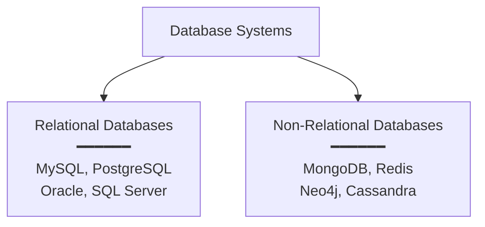

### **Critical Clarification**

⚠️ **Important:** This does **NOT** mean all non-relational databases are similar!

There is **significant diversity** within the NoSQL category. Different types solve different problems.

---

## **What Makes Non-Relational Databases Interesting?**

### **Key Advantage: Out-of-the-Box Horizontal Scalability**

**Most non-relational databases SHARD out-of-the-box!!**

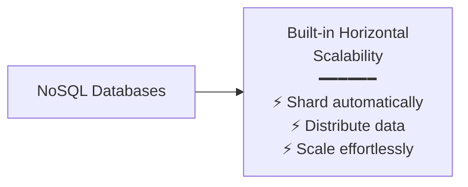

**This means:**
- Built-in support for distributing data across multiple servers
- Native partitioning and sharding capabilities
- Designed from ground-up for horizontal scalability
- Less operational complexity compared to sharding relational databases

**Contrast with Relational Databases:**
- Relational databases can be sharded, but it requires significant effort
- NoSQL databases have sharding as a first-class citizen

---

## **Three Most Important Types of NoSQL Databases**

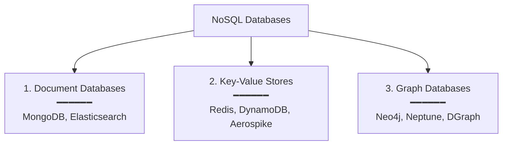

---

## **1. Document Databases**

### **Examples**
- **MongoDB** (most popular)
- **Elasticsearch** (search-oriented)
- CouchDB
- Amazon DocumentDB

### **Core Characteristics**

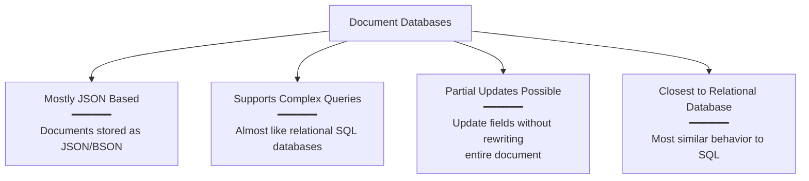

### **1. Mostly JSON Based**

Documents are stored in JSON (or BSON - Binary JSON) format.

**Example Document:**
```json
{
  "user_id": 12345,
  "name": "Alice",
  "email": "alice@example.com",
  "total_posts": 270,
  "created_at": "2023-01-15",
  "preferences": {
    "theme": "dark",
    "notifications": true
  },
  "tags": ["developer", "writer"]
}
```

### **2. Supports Complex Queries**

**Almost like relational (SQL) databases** - You can perform sophisticated queries.

**Query Examples:**

```javascript
// MongoDB query examples

// Find users with more than 100 posts
db.users.find({ total_posts: { $gt: 100 } })

// Aggregation - count posts by user
db.posts.aggregate([
  { $group: { _id: "$user_id", count: { $sum: 1 } } }
])

// Join-like operations (lookup)
db.orders.aggregate([
  {
    $lookup: {
      from: "users",
      localField: "user_id",
      foreignField: "_id",
      as: "user_info"
    }
  }
])

// Text search
db.articles.find({ $text: { $search: "database scaling" } })
```

**Capabilities:**
- Filtering and sorting
- Aggregations (SUM, COUNT, AVG)
- Joins (via $lookup in MongoDB)
- Full-text search
- Geospatial queries

### **3. Partial Updates to Documents Possible**

**Critical Feature:** You can **update specific fields** without rewriting the entire document.

**Example Scenario:**

```javascript
// Document before update
{
  "user_id": 12345,
  "total_posts": 270
}

// Partial update - increment total_posts
db.users.update(
  { user_id: 12345 },
  { $inc: { total_posts: 1 } }
)

// Document after update
{
  "user_id": 12345,
  "total_posts": 271
}
```

**Without rewriting the entire document!**

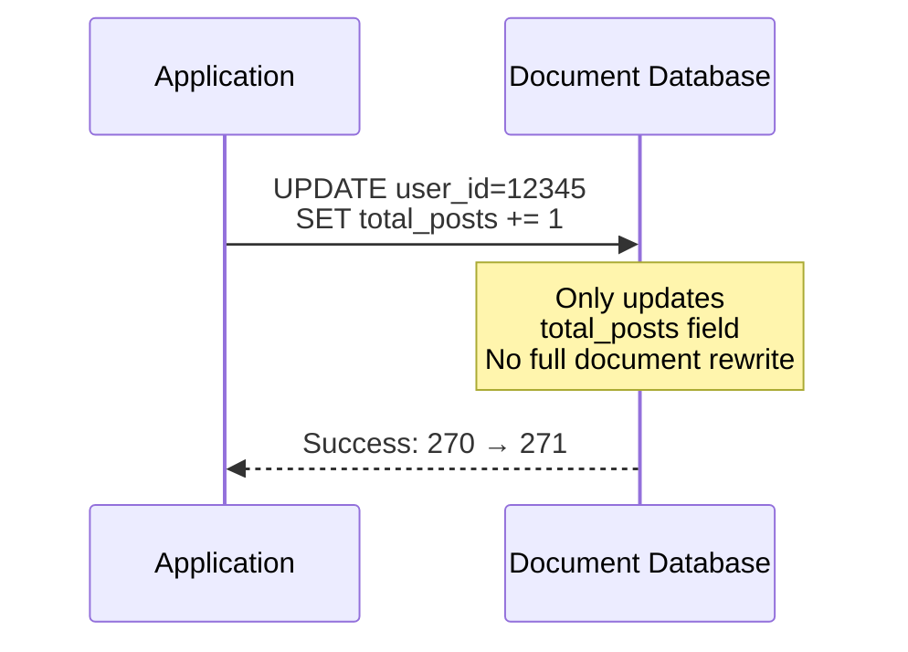

**Benefits:**
- **Efficiency** - Only changed fields are written
- **Performance** - Less data transfer
- **Atomicity** - Field-level atomic operations
- **Concurrency** - Better concurrent update handling

### **4. Closest to Relational Database**

Document databases are the **most similar** to traditional SQL databases among NoSQL options.

**Similarities:**
- Rich query language
- Indexes for performance
- ACID transactions (in modern versions)
- Schema validation (optional)
- Complex data relationships

**Key Difference:**
- Schema-less (flexible structure)
- Horizontal scaling built-in
- JSON-native storage

---

## **Use Cases for Document Databases**

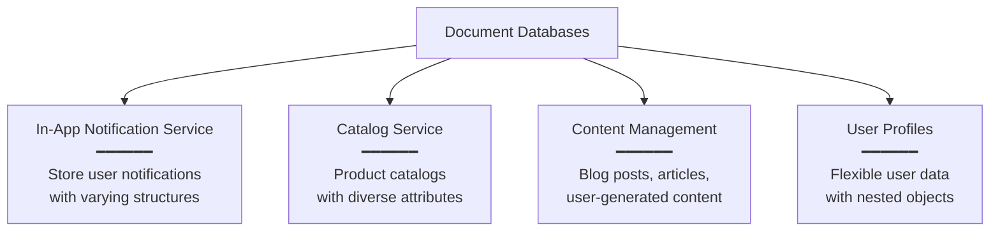

### **1. In-App Notification Service**

**Scenario:** User notifications with varying structures.

```json
// Different notification types with different fields
{
  "notification_id": "n123",
  "user_id": 12345,
  "type": "comment",
  "message": "Alice commented on your post",
  "post_id": 789,
  "timestamp": "2025-01-15T10:30:00Z",
  "read": false
}

{
  "notification_id": "n124",
  "user_id": 12345,
  "type": "follow",
  "message": "Bob started following you",
  "follower_id": 456,
  "timestamp": "2025-01-15T11:00:00Z",
  "read": false
}
```

**Why Document DB:**
- Different notification types have different fields
- Flexible schema accommodates new notification types
- Partial updates to mark as read
- Easy querying by user_id and type

### **2. Catalog Service**

**Scenario:** Product catalog with diverse attributes.

```json
// Electronics
{
  "product_id": "p001",
  "name": "Laptop",
  "category": "electronics",
  "price": 999,
  "specs": {
    "processor": "Intel i7",
    "ram": "16GB",
    "storage": "512GB SSD"
  }
}

// Clothing
{
  "product_id": "p002",
  "name": "T-Shirt",
  "category": "clothing",
  "price": 29,
  "sizes": ["S", "M", "L", "XL"],
  "colors": ["red", "blue", "black"]
}
```

**Why Document DB:**
- Products have vastly different attributes
- No need for sparse columns in relational tables
- Easy to add new product categories
- Rich querying capabilities

### **3. Content Management Systems**

Blog posts, articles, comments with nested structures.

### **4. User Profiles**

User data with preferences, settings, and metadata that vary by user type.

---

## **2. Key-Value Stores**

### **Examples**
- **Redis** (in-memory, extremely fast)
- **DynamoDB** (AWS managed, highly scalable)
- **Aerospike** (high-performance)
- Memcached
- Riak

### **Core Characteristics**

```mermaid
graph TB
    KV[Key-Value Stores]
    
    KV --> SIMPLE[Extremely Simple<br/>━━━━━━<br/>Only 3 operations:<br/>GET(k), PUT(k,v), DEL(k)]
    
    KV --> LIMITED[Limited Functionalities<br/>━━━━━━<br/>No complex queries<br/>No aggregations]
    
    KV --> ACCESS[Key-Based Access Pattern<br/>━━━━━━<br/>Direct lookup by key<br/>O(1) performance]
    
    KV --> SHARD[Heavily Shardable<br/>━━━━━━<br/>Easy to partition<br/>by key hash]

```

### **1. Extremely Simple Databases**

**Only Three Operations:**

```python
# GET - Retrieve value by key
value = db.GET(key)

# PUT - Store value with key
db.PUT(key, value)

# DEL - Delete key-value pair
db.DEL(key)
```

**Example Usage:**

```python
# Store user session
redis.PUT("session:abc123", {"user_id": 12345, "expires": "2025-01-15"})

# Retrieve session
session = redis.GET("session:abc123")

# Delete session (logout)
redis.DEL("session:abc123")
```

### **2. Limited Functionalities**

**Does NOT support:**
- ❌ Complex queries
- ❌ Aggregations (SUM, COUNT, AVG)
- ❌ Joins
- ❌ Filtering by value
- ❌ Sorting by value
- ❌ Full-text search

**This covers most of the use cases** - but for simple use cases, this limitation is acceptable!

### **3. Meant for Key-Based Access Pattern**

**Access Pattern:** You **always access data by key**.

```mermaid
graph LR
    APP[Application]
    
    APP -->|GET user:12345| KV[(Key-Value Store)]
    KV -->|Return value| APP
    
    style KV fill:#4a2d3c,stroke:#7c4a5c,stroke-width:2px
```

**Performance:** O(1) lookups - extremely fast!

**You must know the key** to retrieve data.

### **4. Can Be Heavily Sharded and Partitioned**

**Natural Sharding:** Keys can be easily distributed across shards using hash functions.

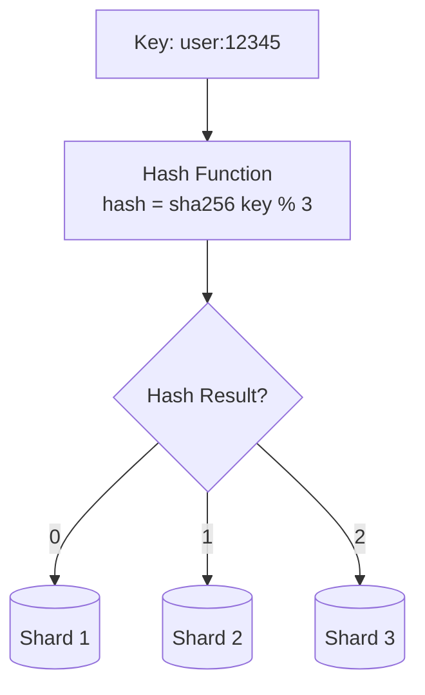

**Sharding Benefits:**
- Simple and deterministic
- No cross-shard queries needed
- Linear scalability
- Perfect for key-based access

---

## **Use Cases for Key-Value Stores**

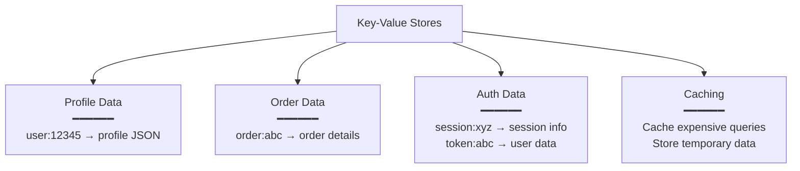

### **1. Profile Data**

```python
# Store user profile
key = f"user:{user_id}"
value = json.dumps({
    "name": "Alice",
    "email": "alice@example.com",
    "bio": "Software Engineer"
})
redis.PUT(key, value)

# Retrieve profile
profile = json.loads(redis.GET(f"user:{user_id}"))
```

### **2. Order Data**

```python
# Store order
key = f"order:{order_id}"
value = json.dumps({
    "user_id": 12345,
    "items": [...],
    "total": 99.99,
    "status": "pending"
})
dynamodb.PUT(key, value)
```

### **3. Auth Data**

```python
# Session management
session_key = f"session:{session_id}"
redis.PUT(session_key, json.dumps({
    "user_id": 12345,
    "expires": "2025-01-15T12:00:00Z"
}))
redis.EXPIRE(session_key, 3600)  # Expires in 1 hour

# Token storage
token_key = f"token:{token}"
redis.PUT(token_key, user_id)
```

### **4. Caching**

```python
# Cache database query results
cache_key = f"query:users:active:count"
cached = redis.GET(cache_key)

if not cached:
    result = db.query("SELECT COUNT(*) FROM users WHERE active = 1")
    redis.PUT(cache_key, result)
    redis.EXPIRE(cache_key, 300)  # Cache for 5 minutes
```

---

## **Important Note: Database Flexibility**

⭐ **You can use relational databases and document DBs as KV stores!**

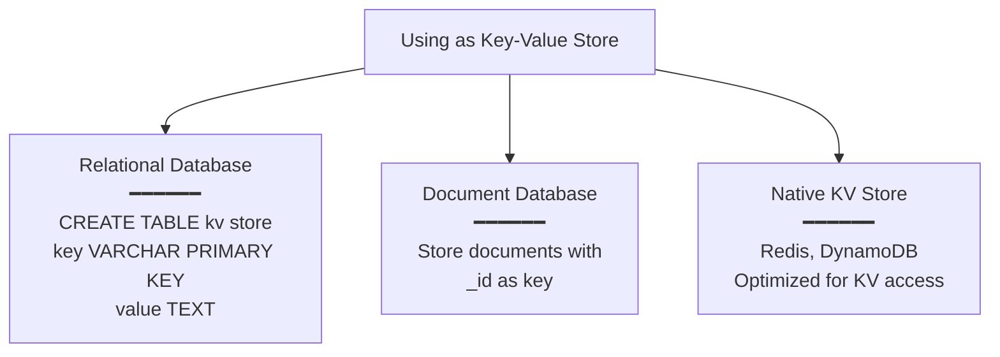

**Example with SQL:**
```sql
CREATE TABLE key_value_store (
    key VARCHAR(255) PRIMARY KEY,
    value TEXT
);

-- Use as KV store
INSERT INTO key_value_store VALUES ('user:123', '{"name": "Alice"}');
SELECT value FROM key_value_store WHERE key = 'user:123';
```

**Example with MongoDB:**
```javascript
// Use _id as key
db.cache.insert({ _id: "user:123", data: { name: "Alice" } })
db.cache.findOne({ _id: "user:123" })
```

**However:** Native KV stores like Redis are **optimized** for this pattern and offer:
- Better performance
- Lower latency
- Memory efficiency
- Built-in expiration
- Atomic operations

---

## **3. Graph Databases**

### **Examples**
- **Neo4j** (most popular)
- **Neptune** (AWS managed)
- **DGraph**
- ArangoDB
- JanusGraph

### **Core Concept**

**"What if our graph data structure had a database?"**

```mermaid
graph LR
    CONCEPT[Graph Data Structure<br/>━━━━━━<br/>Nodes + Edges]
    
    CONCEPT -->|Persistence<br/>Querying<br/>Algorithms| GRAPHDB[(Graph Database)]
    
    style CONCEPT fill:#3d2d1c,stroke:#7c5d4a,stroke-width:2px
    style GRAPHDB fill:#2d3d4a,stroke:#4a6d7c,stroke-width:3px
```

### **Data Model**

**Graph databases store data represented as:**
- **Nodes** (entities/vertices)
- **Edges** (relationships/connections)
- **Relations** (relationship types with properties)

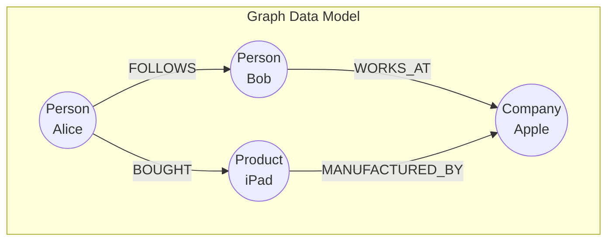

### **Example Relationships**

```cypher
// Neo4j Cypher examples

// A follows B
(Arpit)-[:FOLLOWS]->(Bob)

// Arpit bought iPad
(Arpit)-[:BOUGHT]->(iPad)

// Multi-hop relationship
(Alice)-[:FOLLOWS]->(Bob)-[:FOLLOWS]->(Charlie)
```

**Each relationship can have:**
- **Type** (FOLLOWS, BOUGHT, WORKS_AT)
- **Properties** (date, weight, metadata)
- **Direction** (one-way or bidirectional)

---

## **Key Features of Graph Databases**

### **1. Native Graph Storage**

Data is stored in a way that preserves **relationships as first-class citizens**.

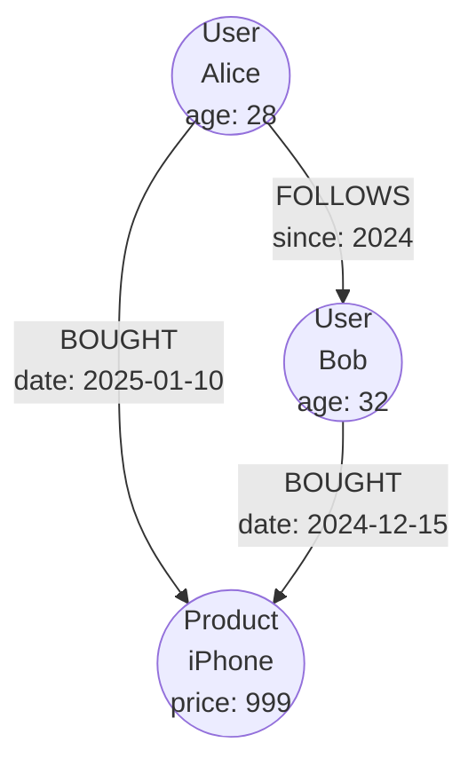

### **2. Great for Running Complex Graph Algorithms**

**Built-in support for:**
- **Shortest path** algorithms
- **PageRank** - importance/centrality
- **Community detection** - clustering
- **Pathfinding** - route optimization
- **Graph traversal** - BFS/DFS
- **Influence propagation**
- **Recommendation algorithms**

```cypher
// Find shortest path between two users
MATCH path = shortestPath(
  (alice:Person {name: "Alice"})-[*]-(bob:Person {name: "Bob"})
)
RETURN path

// Find friends of friends
MATCH (me:Person {name: "Alice"})-[:FOLLOWS]->(friend)-[:FOLLOWS]->(fof)
WHERE NOT (me)-[:FOLLOWS]->(fof) AND me <> fof
RETURN fof.name

// PageRank for influence
CALL gds.pageRank.stream('socialGraph')
YIELD nodeId, score
RETURN gds.util.asNode(nodeId).name AS name, score
ORDER BY score DESC
```

---

## **Use Cases for Graph Databases**

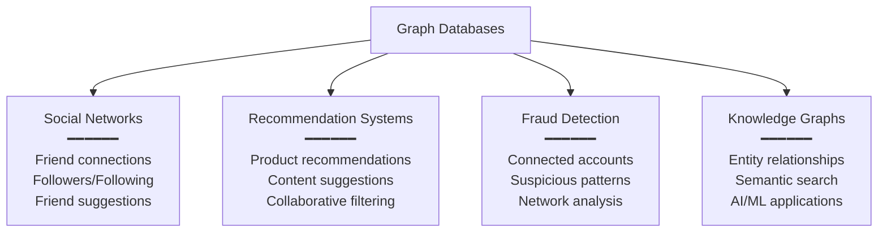

### **1. Social Networks**

**Perfect fit for:**
- Friend/follower relationships
- Friend-of-friend queries
- Mutual connections
- Influence analysis
- Community detection

**Query Example:**
```cypher
// Find mutual friends
MATCH (me:Person {id: 123})-[:FOLLOWS]->(mutual)<-[:FOLLOWS]-(them:Person {id: 456})
RETURN mutual

// Suggest people to follow (friends of friends)
MATCH (me:Person {id: 123})-[:FOLLOWS*2..3]->(suggestion)
WHERE NOT (me)-[:FOLLOWS]->(suggestion) AND me <> suggestion
RETURN suggestion, count(*) as strength
ORDER BY strength DESC
LIMIT 10
```

### **2. Recommendation Systems**

**Pattern:** "People who bought X also bought Y"

```cypher
// Product recommendations
MATCH (user:Person {id: 123})-[:BOUGHT]->(product)<-[:BOUGHT]-(other)
MATCH (other)-[:BOUGHT]->(recommendation)
WHERE NOT (user)-[:BOUGHT]->(recommendation)
RETURN recommendation, count(*) as score
ORDER BY score DESC
LIMIT 5
```

### **3. Fraud Detection**

**Identify patterns:**
- Connected fraudulent accounts
- Money laundering networks
- Identity theft rings

```cypher
// Find suspicious account clusters
MATCH (account:Account)-[:SHARED_IP|SHARED_DEVICE*1..3]-(suspicious:Account)
WHERE suspicious.flagged = true
RETURN account, collect(suspicious)
```

### **4. Knowledge Graphs**

Semantic relationships between entities for AI/ML applications.

---

## **Comparison Table**

| Feature | Document DBs | Key-Value Stores | Graph Databases |
|---------|--------------|------------------|-----------------|
| **Data Model** | JSON documents | Key-value pairs | Nodes + Edges |
| **Query Complexity** | High (SQL-like) | Very Low (GET/PUT/DEL) | High (graph traversal) |
| **Schema** | Flexible | None | Flexible |
| **Scalability** | Excellent | Excellent | Good |
| **Best For** | Varied structured data | Simple lookups | Relationships |
| **Example** | User profiles, catalogs | Caching, sessions | Social networks |
| **Partial Updates** | ✓ Yes | ✓ Yes | ✓ Yes |
| **Aggregations** | ✓ Yes | ❌ No | ⚠️ Limited |
| **Joins** | ⚠️ Limited | ❌ No | ✓ Native |

---

## **When to Use Which?**

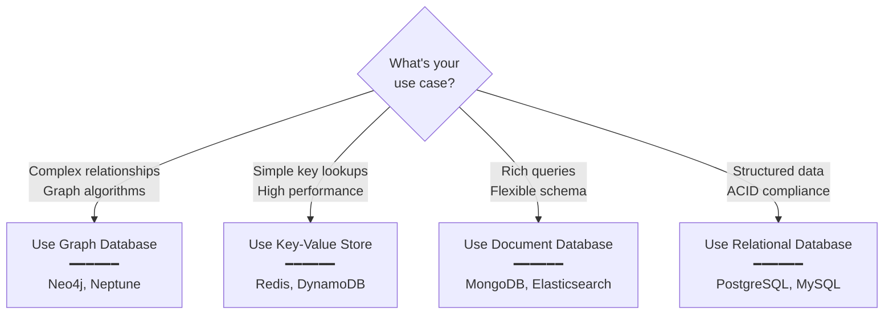

---

## **Key Takeaways**

✅ **NoSQL is a broad category** - not all non-relational databases are similar

✅ **Horizontal scalability** - Most NoSQL databases shard out-of-the-box

✅ **Three main types:**
- **Document DBs** - JSON-based, rich queries, closest to SQL
- **Key-Value Stores** - Simple, fast, key-based access only
- **Graph DBs** - Relationships first, complex graph algorithms

✅ **Document databases:**
- Support complex queries and partial updates
- Best for catalogs, notifications, content management
- Almost like relational databases with better scalability

✅ **Key-value stores:**
- Only GET, PUT, DEL operations
- Extremely fast for simple lookups
- Perfect for caching, sessions, auth data
- Can be heavily sharded

✅ **Graph databases:**
- Store nodes, edges, and relationships
- Excellent for social networks and recommendations
- Native support for graph algorithms

✅ **Flexibility:** You can use relational/document DBs as KV stores (but native KV stores are optimized)

✅ **Choose based on access patterns:** Your data access patterns should drive database choice

**Remember:** Each database type solves specific problems. Use the right tool for the job!
